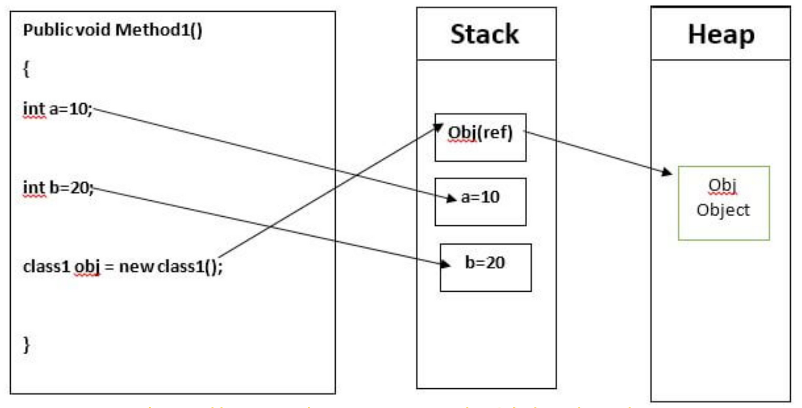
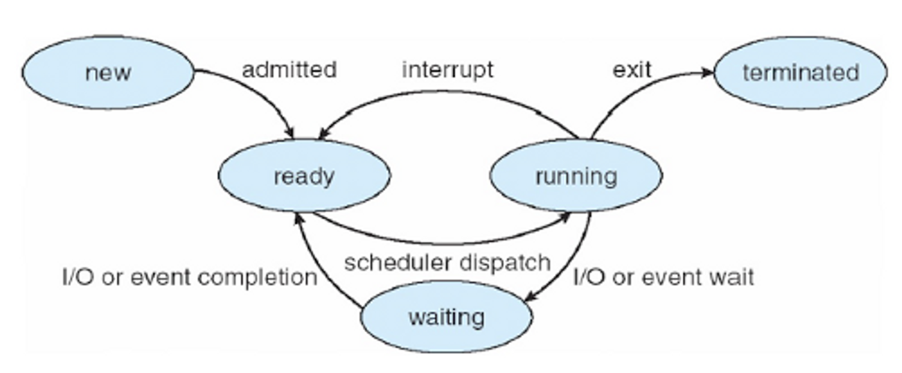

# Operating System

## 운영체제 기초

운영체제란 무엇일까요?

**운영 체제(OS, Operating System)** 란 컴퓨터 시스템의 자원을 효율적으로 관리하며 사용자가 컴퓨터를 편리하고 효과적으로 사용할 수 있는 환경을 제공하는 여러 프로그램들의 모임이다. 그리고 응용 프로그램과 하드웨어 간의 인터페이스로서 다른 응용 프로그램이 유용한 작업을 할 수 있도록 환경을 제공해준다.

넓은 의미에서는 커널 뿐만 아니라 시스템을 위한 유틸리티를 포함하는 개념을 갖고 있으며 좁은 의미에서는 메모리에 올라가있는 커널을 의미한다.

> 커널이란?
>
> - 전체 운영체제 코드 중 메모리에 올라가있는 부분을 커널이라고 한다.

운영체제는 어떤 기능을 하는지 설명해주세요

- CPU 스케줄링
- 메모리 관리
- 파일 관리
- 입출력 관리
- 프로세스 관리
- 네트워킹
- 보호
    - 시스템의 오류를 검사하고 복구합니다.
    - 자원 보호 기능을 제공합니다.

운영체제가 관리하는 5가지 지원에 대해 설명해주세요

**프로세스 관리**

- 프로세스의 스케줄링과 동기화 관리를 담당한다.
- 프로세스의 생성과 제거, 시작과 정지, 메시지 전달 등의 기능을 담당한다.

**저장장치 관리**

저장장치에는 1차 저장장치인 메인 메모리와 2차 저장장치인 하드디스크, NAND등이 있다. 운영체제는 이러한 저장장치를 관리하며 프로세스에게 메모리 할당 및 회수, 파일 생성과 삭제, 변경, 유지 등의 관리를 한다.

- 1차 저장장치 (Main Memory)
    - 프로세스에 할당하는 메모리
    - 영역의 할당과 해제각 메모리 영역 간의 침범 방지
    - 메인 메모리의 효율적 활용을 위한 가상 메모리 기능
- 2차 저장장치(HDD, NAND Flash Memory 등)
    - 파일 형식의 데이터 저장
    - 이런 파일 데이터 관리를 위한 파일 시스템을 OS에서 관리
    - `FAT, NTFS, EXT2, JFS, XFS` 등 많은 파일 시스템들이 개발되어 사용 중

**네트워킹**

TCP/IP기반의 인터넷에 연결하거나 응용 프로그램이 네트워크를 사용하면 OS에서 네트워크 프로토콜을 지원해야한다. 이처럼 OS는 응용 프로그램과 하드웨어 사이의 인터페이스 역하을 하며 하드웨어를 소프트웨어적으로 제어 및 관리를 하는 것을 알 수 있다.

**주변장치 관리**

- 입출력 장치의 스케줄링 및 전반적인 관리를 담당한다.
- 디바이스 드라이버를 OS가 관리하여 여러 하드웨어를 사용할 수 있게 해준다.

**사용자 관리**

사용자별 계정을 관리할 수 있는 사용자 관리 기능을 제공한다.

시분할 시스템, 다중 프로그래밍 시스템, 대화형 시스템은 각각 무엇을 의미할까요?

- CPU 작업시간을 여러 프로그램이 나누어 쓰는 시스템을 **시분할 시스템(time sharing system)**이라고 부른다.
- 메모리 공간을 분할해 여러 프로그램들을 동시에 메모리에 올려서 처리하는 시스템을 **다중 프로그래밍 시스템(multi-programming system)**이라고 한다.
- 사용자 관점에서 각 프로그램에 대한 키보드 입력의 결과를 곧바로 화면에 보여주는 것과 같은 시스템을 **대화형 시스템(interactive system)**이라고 한다.

→ 세 시스템 모두 여러 프로그램이 하나의 컴퓨터에서 동시에 실행되는 다중작업용 운영체제에 속한다.

인터럽트란 무엇일까요?

CPU가 프로그램을 실행하고 있는중 예기치 않은 상황이나 지금보다 먼저 수행해야하는 일이  발생한 경우 현재 실행 중인 작업을 즉시 중단하고, 발생된 상황에 대한 우선 처리가 필요함을 CPU에게 알리는 것을 의미한다.

- 하드웨어적으로 시그널을 확인하는 방식이다.
- 인터럽트 발생시에만 처리를 하여 시스템 부하가 적다.

이러한 인터럽트는 크게 하드웨어 인터럽트와 소프트웨어 인터럽트로 나뉘게 된다.

### 하드웨어 인터럽트

각각의 Hardware I/O device에서 발생한 인터럽트를 하드웨어 인터럽트라고 한다.

- 종류
  - 입출력 인터럽트 (I/O interrupt) - 입출력 작업의 종료나 입출력 오류에 의해 CPU의 기능이 요청됨
  - 정전,전원 이상 인터럽트(Power fail interrupt) - 전원 공급의 이상
  - 기계 착오 인터럽트(Machine check interrupt) - CPU의 기능적인 오류
  - 외부 신호 인터럽트(External interrupt) - I/O 장치가 아닌 오퍼레이터나 타이머에 의해 의도적으로 프로그램이 중단된 경우

### 소프트웨어 인터럽트 (= trap)

- CPU 내부에서 자신이 실행한 명령이나 CPU의 명령 실행에 관련된 모듈이 발생하는 경우 발생한다.
- 프로그램의 오류에 의해 생기거나 System call을 호출할 때 발생한다.
- 종류
  - **System call**: 애플리케이션이 kernel의 함수를 실행하기 위해 system call을 발생시킨다.
  - Exception
    - divide by zero, overflow/underflow, etc..

### 인터럽트 실행 과정

- Device controller는 요청한 작업이 끝나면 interrupt를 발생시켜 interrupt request line에 쌓아 둔다.
- CPU는 각각의 instruction이 끝날 때마다 interrupt line이 setting됐는지 확인을 하고 setting됐으면 CPU는 instruction의 수행을 멈추고 interrupt handler를 통해 interrupt를 처리한다.
- Interrupt가 발생하면 CPU는 interrupt vector로 실행을 전송한다. Interrupt vector는 interrupt service routine의 address를 알고 있어 해당 address를 알려주고 CPU는 해당 service routine을 실행시킨다. 실행이 끝나면 작업을 마친 프로세스를 block 상태에서 ready상태로 변경하고 기존의 수행 중이던 process를 이어서 수행한다. (프로세스의 우선순위에 따라 인터럽트 처리를 마친 프로세스를 바로 실행할 수도 있다.)

### 📚 Reference
- [인터럽트(Interrupt)의 개념과 종류](https://raisonde.tistory.com/entry/%EC%9D%B8%ED%84%B0%EB%9F%BD%ED%8A%B8Interrupt%EC%9D%98-%EA%B0%9C%EB%85%90%EA%B3%BC-%EC%A2%85%EB%A5%98)
- [[OS] Interrupt 인터럽트란?](https://doh-an.tistory.com/31)

폴링(Polling)이란 무엇일까요?

- 인터럽트와 같게 CPU가 다른 프로세스를 실행하는 동안 디바이스로 부터 발생하는 이벤트들을 처리하는 방법 중 하나이다.
- 폴링 방식은 특정 주기마다 CPU가 디바이스들이 serving(이벤트 처리)이 필요한지 체크하여야해서 CPU 사이클의 낭비가 발생한다.
    - 폴링은 특정 주기마다 CPU가 디바이스를 poll할 때만 serving이 가능하다. 하지만 인터럽트는 언제든지 발생할 수 있다.
- 인터럽트와 다르게 소프트웨어적으로 시그널을 확인하는 방식이다.
- 장점으로는 구현이 쉽고 우선순위의 변경이 용이하다는 점이 있다.

> 인터럽트는 폴링 방식과 다르게 하드웨어로 지원을 받아야하는 제약이 있다. 하지만 폴링 방식보다 신속하게 대응하는 것이 가능하여 실시간 대응이 필요할 때 필수적인 기능이다. 즉, 인터럽트는 발생시기를 예측하기 힘든 경우 컨트롤러가 가장 빠르게 대응할 수 있는 방식이다.

### 📚 Reference
- [Interrupt와 polling의 차이](https://seonggyu.tistory.com/26)

Mode bit이란 무엇일까요?

- 사용자 장치의 잘못된 수행으로 다른 프로그램 및 운영체제에 피해가 가지 않도록 하기 위한 Mode bit이라는 보호장치가 존재한다.
- Mode bit은 **하드웨어적**으로 두가지 모드의 operation을 지원한다.
  - 1이면 user mode (사용자 프로그램 수행)
  - 0이면 kernel mode (OS코드 수행)
- Privileged instruction은 파일을 다루거나 I/O에게 request를 하는 등 OS만 실행할 수 있는 instruction으로 kernel mode에서만 수행가능하다.
- 만약 user mode에서 실행하려고 하면 프로그램을 종료하고 software interrupt가 발생한다. User Program이 hardware에 접근하려면 system call을 통해 실행하여야 한다.

System Call이란 무엇일까요?

User program이 접근하지 못하는 OS만의 Privileged instruction을 실행하기 위해 OS에게 특정 일들을 수행해달라고 요청하는 것으로 Software interrupt이다. 이는 User program과 OS사이의 interface를 제공한다.

System call이 발생하면 mode bit을 0으로 변경하여 요청된 작업을 처리하고 다시 유저모드인 1로 변경하여 유저 프로세스가 수행되게 된다.

System Call과 Function Call의 차이점에 대해 설명해주세요

fuction call은 같은 process 내에서 process 내에 있는 function 을 불러서 수행하는 것이다. 반면에 System call은 OS의 도움을 받아 OS의 function을 불러서 수행하는 것이다.

DMA란 무엇일까요?

- 모든 메모리의 접근은 CPU에 의해 접근이 가능하여, 메모리의 접근을 위해서는 CPU에게 인터럽트를 발생시켜 부탁해야 했다. 이러한 구조는 모든 메모리 연산이 필요할 때마다 interrupt를 발생시키고, CPU는 인터럽트를 처리하기 위해 로컬버퍼와 메모리 사이에서 데이터를 옮기는 일까지 진행했다. 이러한 이유때문에 CPU의 효율성이 떨어지는 문제가 존재하였다. 비효율을 극복하기 위해 CPU이외에 메모리 접근이 가능한 장치가 있는데 이를 DMA(Direct Memory Access)라고 한다.
- DMA는 일종의 컨트롤러 장치로서, CPU가 입출력 장치들의 메모리 접근 요청에 의해 자주 인터럽트 당하는 것을 막아주는 역할을 한다.
- **DMA를 사용하면 로컬버퍼에서 메모리로 데이터를 읽어오는 작업을 CPU가 아닌 DMA가 대행하게 된다.** 덕분에 CPU가 인터럽트를 처리할 필요가 없다.
- DMA는 바이트단위가 아닌 블록 단위로 데이터를 메모리로 읽어온 후 CPU에게 인터럽트를 발생시켜 작업의 완료를 알린다.
  - CPU에 발생하는 인터럽트의 빈도를 줄여 CPU를 좀 더 효울적으로 관리할 수 있게 해준다.

## 프로세스와 스레드

프로세스와 프로세서의 차이에 대해 설명해주세요.

- 프로세스는 코드로 작성된 프로그램이 메모리에 적재되어 사용할 수 있는 상태가 된 것이다. 즉, 메모리 상에서 실행중인 프로그램을 프로세스라고 한다.
- 프로세서는 CPU를 의미한다.

프로세스와 스레드의 차이를 설명해주세요

- 프로세스는 메모리에 적재된 하나의 프로그램을 의미한다.
- 스레드는 CPU에서 동작하는 가장 작은 단위의 작업 단위이다.

> 프로세스는 운영체제로부터 자원을 할당받는 작업의 단위이고 스레드는 프로세스가 할당받은 자원을 이용하는 실행의 단위이다.

> 하나의 프로세스는 1개 이상의 여러 스레드가 들어갈 수 있으며 컨테이너는 스레드를 관리하는 컨테이너로 볼 수 있다.

프로세스의 주소 공간은 어떻게 이루어져 있을까요? 그리고 각각의 주소 공간에는 어떤 데이터가 저장될까요?

- **Text (Code)**: 코드 자체를 구성하는 메모리 영역
- **Data**:  전역변수, 정적 변수, 배열과 같은 static data (global variable)
  - 초기화된 데이터는 data 영역에 저장하며 초기화되지 않은 데이터는 bss 영역에 저장한다.
- **Stack**: 지역변수, 매개변수, 리턴 값과 같은 데이터를 저장하는 임시 메모리 영역이다. (local variable, function parameter, return address)
- **Heap**: run time 시점에 동적 할당되는 데이터들이 저장된다. (malloc, java object)

  > C에서 Pointer 변수 같은 경우 stack에는 데이터의 주소값들이 저장이 되고 heap에는 실제 값이 저장된다.

  > Java의 경우 객체 생성에서 비슷한 예시가 있다.
  >
  >
  > 
  >
  > int a,b는 local variable이어서 stack에 저장이 되고 class1 obj도 local variable이어서 stack에 저장이 되는데 object의 실제 내용은 heap에 저장이 되고 stack에서는 주소값을 갖고 있다. object는 생성이 되면 처음에는 stack에 주소값만 생성이 되고 실제로 할당이 되면 그때서야 heap이 생성되고 실제 데이터가 저장이 된다.

프로세스 주소 공간을 나눈 이유는 무엇일까요?

최대한 데이터를 공유하며 메모리 사용량을 줄이기 떄문이다.

Code와 같은 프로그램 자체의 정보는 같은 변함이 없는 같은 내용이기에 따로 관리를 하며 공유를 한다. 반면에 Stack, Data는 스택 구조의 특성과 전역 변수의 활용성을 위해서 나누게 되었다.

프로세스의 상태에는 어떤 것이 있을까요?

- **New**: process가 생성중인 상태
- **Ready**: CPU를 사용하려고 기다리는 상태 (할당이 되면 바로 시행하려고 proces 가 메모리에 올라가 있다.)
- **Running**: CPU를 잡고 instruction을 수행중인 상태
- **Blocked(wait, sleep)**: CPU를 주어도 당장 instruction을 수행할 수 없는 상태, process 자신이 요청한 event (I/O, 공유하는 데이터 등)가 즉시 만족되지 않아 이를 기다리는 상태이다. 요청한 event가 수행을 마치면 interrupt를 발생시키고 blocked상태의 process를 ready queue에 옮겨준다.
- **Terminated**: 수행이 끝난 상태

프로세스의 Running State에서 CPU 자원을 뺐기는 3가지 상황에 대해 설명해주세요

1. Interrupt가 발생했을 때 (timer도 포함)
2. I/O request를 하기 위해 system call을 하여 waiting상태로 넘어가는 경우
3. Process의 수행이 끝나서 terminated로 되는 경우

OS는 프로세스의 정보를 어떻게 관리하며 어떤 데이터들을 저장하고 있는지 설명해주세요 (hint.PCB)

각각의 Process들은 OS의 관리를 받게 되는데 이때 OS는 process의 현재 정보들을 알기 위해 PCB(Process Control Block)를 사용한다.

PCB는 아래의 정보들을 저장하고 있다.

- Process **state**
- Process number: process id (**pid**)
- **Program counter** (PC) - next instruction address
- **CPU register** – contents of registers (in CPU)
- etc (Owner, CPU Usage, Memory Usage, Process Priority, I/O status information)

PCB가 왜 필요할까요?

CPU core는 하나의 프로세스가 사용하지 않고 여러 프로세스가 공유해서 사용한다. 이때 프로세스의 교체(Context switching)이 발생할 때마다 실행중인 CPU에 올라간 프로세스의 정보를 변경해야하고, 프로세스들은 추후 CPU 이용 순서가 왔을 때 이전 작업 내용을 이어서 하기 위해 정보를 저장해야할 필요가 있다. 운영체제는 이러한 프로세스의 정보를 PCB를 통해 저장하고 관리하고 있다.

Context Switching이 발생할 때는 PCB의 값들을 변경하게 되며 PCB의 정보를 통해 연산을 이어서 한다.

PCB는 어떻게 관리될까요??

- kernel의 data영역은 CPU, memory, disk등의 데이터들을 각각 갖고 있다. 그리고 각각의 process의 정보들을 갖고 있는 PCB들이 존재한다. 즉, PCB는 kernel의 data 영역에서 관리된다.

  

- 이때 PCB들은 Linked List 방식으로 관리가 된다. PCB List Head에 PCB들이 생성될 때마다 붙게 된다. 주소값으로 연결이 이루어져 있는 연결리스트이기 때문에 삽입 삭제가 용이하다.
- 프로세스가 생성되면 PCB가 생성되고 프로세스가 종료되면 PCB도 제거된다.

