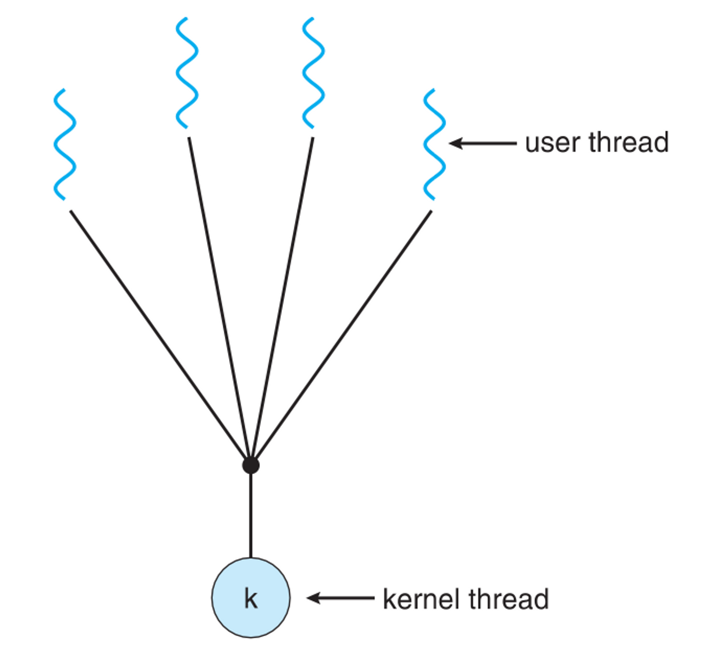
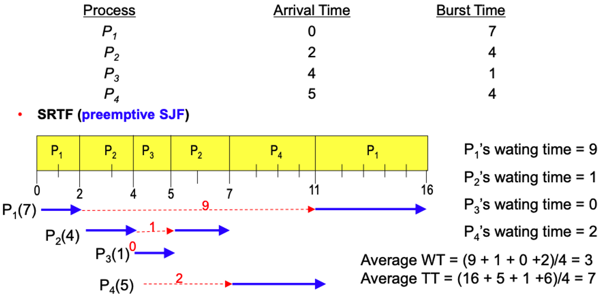
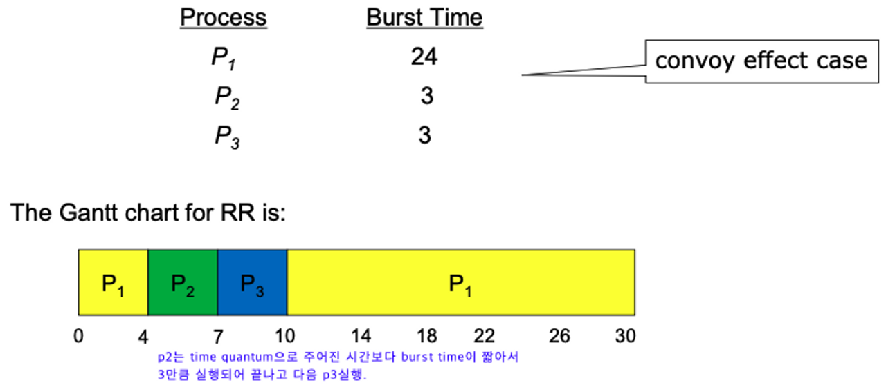
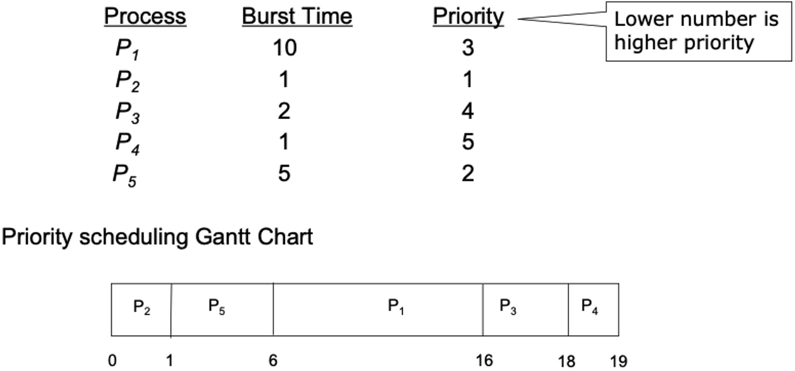
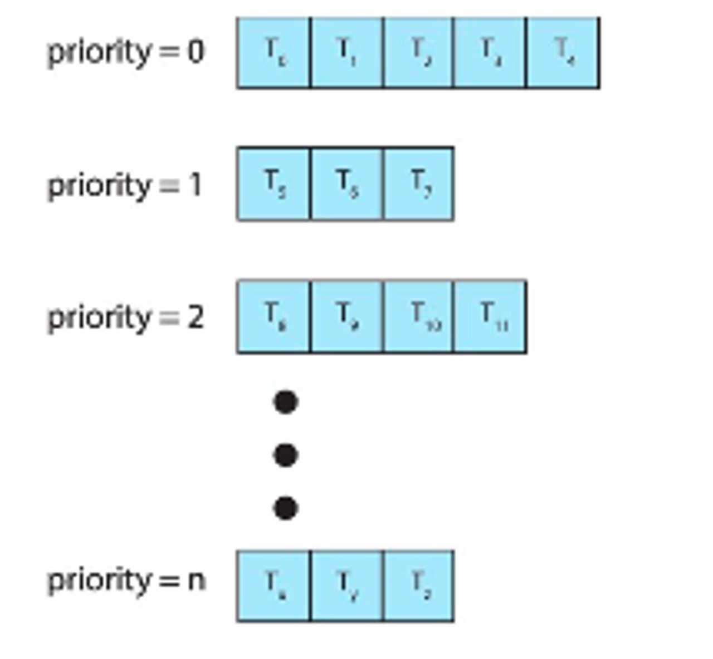
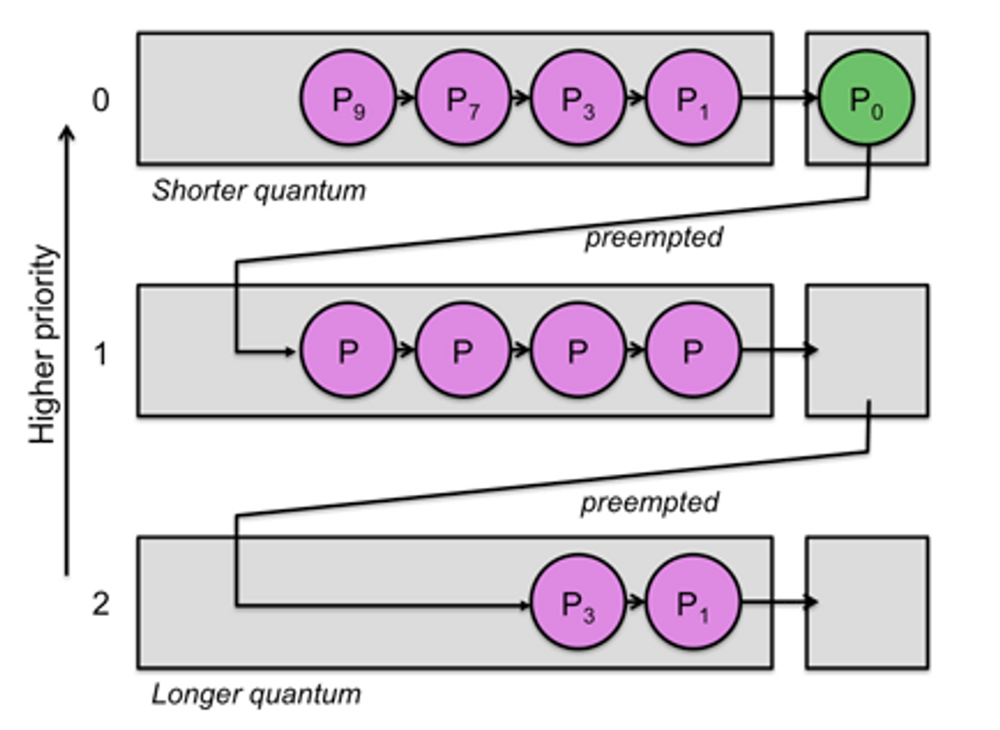
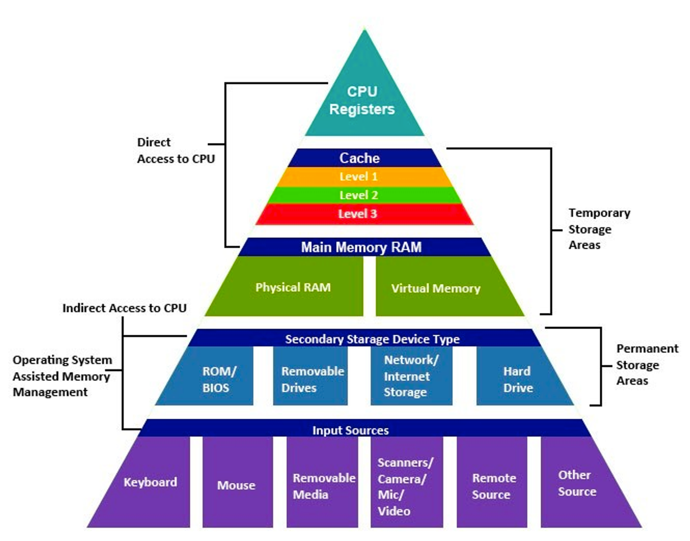

# Operating System

## 운영체제 기초

운영체제란 무엇일까요?

**운영 체제(OS, Operating System)** 란 컴퓨터 시스템의 자원을 효율적으로 관리하며 사용자가 컴퓨터를 편리하고 효과적으로 사용할 수 있는 환경을 제공하는 여러 프로그램들의 모임이다. 그리고 응용 프로그램과 하드웨어 간의 인터페이스로서 다른 응용 프로그램이 유용한 작업을 할 수 있도록 환경을 제공해준다.

넓은 의미에서는 커널 뿐만 아니라 시스템을 위한 유틸리티를 포함하는 개념을 갖고 있으며 좁은 의미에서는 메모리에 올라가있는 커널을 의미한다.

> 커널이란?
>
> - 전체 운영체제 코드 중 메모리에 올라가있는 부분을 커널이라고 한다.

운영체제는 어떤 기능을 하는지 설명해주세요

- CPU 스케줄링
- 메모리 관리
- 파일 관리
- 입출력 관리
- 프로세스 관리
- 네트워킹
- 보호
    - 시스템의 오류를 검사하고 복구합니다.
    - 자원 보호 기능을 제공합니다.

운영체제가 관리하는 5가지 지원에 대해 설명해주세요

**프로세스 관리**

- 프로세스의 스케줄링과 동기화 관리를 담당한다.
- 프로세스의 생성과 제거, 시작과 정지, 메시지 전달 등의 기능을 담당한다.

**저장장치 관리**

저장장치에는 1차 저장장치인 메인 메모리와 2차 저장장치인 하드디스크, NAND등이 있다. 운영체제는 이러한 저장장치를 관리하며 프로세스에게 메모리 할당 및 회수, 파일 생성과 삭제, 변경, 유지 등의 관리를 한다.

- 1차 저장장치 (Main Memory)
    - 프로세스에 할당하는 메모리
    - 영역의 할당과 해제각 메모리 영역 간의 침범 방지
    - 메인 메모리의 효율적 활용을 위한 가상 메모리 기능
- 2차 저장장치(HDD, NAND Flash Memory 등)
    - 파일 형식의 데이터 저장
    - 이런 파일 데이터 관리를 위한 파일 시스템을 OS에서 관리
    - `FAT, NTFS, EXT2, JFS, XFS` 등 많은 파일 시스템들이 개발되어 사용 중

**네트워킹**

TCP/IP기반의 인터넷에 연결하거나 응용 프로그램이 네트워크를 사용하면 OS에서 네트워크 프로토콜을 지원해야한다. 이처럼 OS는 응용 프로그램과 하드웨어 사이의 인터페이스 역하을 하며 하드웨어를 소프트웨어적으로 제어 및 관리를 하는 것을 알 수 있다.

**주변장치 관리**

- 입출력 장치의 스케줄링 및 전반적인 관리를 담당한다.
- 디바이스 드라이버를 OS가 관리하여 여러 하드웨어를 사용할 수 있게 해준다.

**사용자 관리**

사용자별 계정을 관리할 수 있는 사용자 관리 기능을 제공한다.

시분할 시스템, 다중 프로그래밍 시스템, 대화형 시스템은 각각 무엇을 의미할까요?

- CPU 작업시간을 여러 프로그램이 나누어 쓰는 시스템을 **시분할 시스템(time sharing system)**이라고 부른다.
- 메모리 공간을 분할해 여러 프로그램들을 동시에 메모리에 올려서 처리하는 시스템을 **다중 프로그래밍 시스템(multi-programming system)**이라고 한다.
- 사용자 관점에서 각 프로그램에 대한 키보드 입력의 결과를 곧바로 화면에 보여주는 것과 같은 시스템을 **대화형 시스템(interactive system)**이라고 한다.

→ 세 시스템 모두 여러 프로그램이 하나의 컴퓨터에서 동시에 실행되는 다중작업용 운영체제에 속한다.

인터럽트란 무엇일까요?

CPU가 프로그램을 실행하고 있는중 예기치 않은 상황이나 지금보다 먼저 수행해야하는 일이  발생한 경우 현재 실행 중인 작업을 즉시 중단하고, 발생된 상황에 대한 우선 처리가 필요함을 CPU에게 알리는 것을 의미한다.

- 하드웨어적으로 시그널을 확인하는 방식이다.
- 인터럽트 발생시에만 처리를 하여 시스템 부하가 적다.

이러한 인터럽트는 크게 하드웨어 인터럽트와 소프트웨어 인터럽트로 나뉘게 된다.

### 하드웨어 인터럽트

각각의 Hardware I/O device에서 발생한 인터럽트를 하드웨어 인터럽트라고 한다.

- 종류
  - 입출력 인터럽트 (I/O interrupt) - 입출력 작업의 종료나 입출력 오류에 의해 CPU의 기능이 요청됨
  - 정전,전원 이상 인터럽트(Power fail interrupt) - 전원 공급의 이상
  - 기계 착오 인터럽트(Machine check interrupt) - CPU의 기능적인 오류
  - 외부 신호 인터럽트(External interrupt) - I/O 장치가 아닌 오퍼레이터나 타이머에 의해 의도적으로 프로그램이 중단된 경우

### 소프트웨어 인터럽트 (= trap)

- CPU 내부에서 자신이 실행한 명령이나 CPU의 명령 실행에 관련된 모듈이 발생하는 경우 발생한다.
- 프로그램의 오류에 의해 생기거나 System call을 호출할 때 발생한다.
- 종류
  - **System call**: 애플리케이션이 kernel의 함수를 실행하기 위해 system call을 발생시킨다.
  - Exception
    - divide by zero, overflow/underflow, etc..

### 인터럽트 실행 과정

- Device controller는 요청한 작업이 끝나면 interrupt를 발생시켜 interrupt request line에 쌓아 둔다.
- CPU는 각각의 instruction이 끝날 때마다 interrupt line이 setting됐는지 확인을 하고 setting됐으면 CPU는 instruction의 수행을 멈추고 interrupt handler를 통해 interrupt를 처리한다.
- Interrupt가 발생하면 CPU는 interrupt vector로 실행을 전송한다. Interrupt vector는 interrupt service routine의 address를 알고 있어 해당 address를 알려주고 CPU는 해당 service routine을 실행시킨다. 실행이 끝나면 작업을 마친 프로세스를 block 상태에서 ready상태로 변경하고 기존의 수행 중이던 process를 이어서 수행한다. (프로세스의 우선순위에 따라 인터럽트 처리를 마친 프로세스를 바로 실행할 수도 있다.)

### 📚 Reference
- [인터럽트(Interrupt)의 개념과 종류](https://raisonde.tistory.com/entry/%EC%9D%B8%ED%84%B0%EB%9F%BD%ED%8A%B8Interrupt%EC%9D%98-%EA%B0%9C%EB%85%90%EA%B3%BC-%EC%A2%85%EB%A5%98)
- [[OS] Interrupt 인터럽트란?](https://doh-an.tistory.com/31)

폴링(Polling)이란 무엇일까요?

- 인터럽트와 같게 CPU가 다른 프로세스를 실행하는 동안 디바이스로 부터 발생하는 이벤트들을 처리하는 방법 중 하나이다.
- 폴링 방식은 특정 주기마다 CPU가 디바이스들이 serving(이벤트 처리)이 필요한지 체크하여야해서 CPU 사이클의 낭비가 발생한다.
    - 폴링은 특정 주기마다 CPU가 디바이스를 poll할 때만 serving이 가능하다. 하지만 인터럽트는 언제든지 발생할 수 있다.
- 인터럽트와 다르게 소프트웨어적으로 시그널을 확인하는 방식이다.
- 장점으로는 구현이 쉽고 우선순위의 변경이 용이하다는 점이 있다.

> 인터럽트는 폴링 방식과 다르게 하드웨어로 지원을 받아야하는 제약이 있다. 하지만 폴링 방식보다 신속하게 대응하는 것이 가능하여 실시간 대응이 필요할 때 필수적인 기능이다. 즉, 인터럽트는 발생시기를 예측하기 힘든 경우 컨트롤러가 가장 빠르게 대응할 수 있는 방식이다.

### 📚 Reference
- [Interrupt와 polling의 차이](https://seonggyu.tistory.com/26)

Mode bit이란 무엇일까요?

- 사용자 장치의 잘못된 수행으로 다른 프로그램 및 운영체제에 피해가 가지 않도록 하기 위한 Mode bit이라는 보호장치가 존재한다.
- Mode bit은 **하드웨어적**으로 두가지 모드의 operation을 지원한다.
  - 1이면 user mode (사용자 프로그램 수행)
  - 0이면 kernel mode (OS코드 수행)
- Privileged instruction은 파일을 다루거나 I/O에게 request를 하는 등 OS만 실행할 수 있는 instruction으로 kernel mode에서만 수행가능하다.
- 만약 user mode에서 실행하려고 하면 프로그램을 종료하고 software interrupt가 발생한다. User Program이 hardware에 접근하려면 system call을 통해 실행하여야 한다.

System Call이란 무엇일까요?

User program이 접근하지 못하는 OS만의 Privileged instruction을 실행하기 위해 OS에게 특정 일들을 수행해달라고 요청하는 것으로 Software interrupt이다. 이는 User program과 OS사이의 interface를 제공한다.

System call이 발생하면 mode bit을 0으로 변경하여 요청된 작업을 처리하고 다시 유저모드인 1로 변경하여 유저 프로세스가 수행되게 된다.

System Call과 Function Call의 차이점에 대해 설명해주세요

fuction call은 같은 process 내에서 process 내에 있는 function 을 불러서 수행하는 것이다. 반면에 System call은 OS의 도움을 받아 OS의 function을 불러서 수행하는 것이다.

DMA란 무엇일까요?

- 모든 메모리의 접근은 CPU에 의해 접근이 가능하여, 메모리의 접근을 위해서는 CPU에게 인터럽트를 발생시켜 부탁해야 했다. 이러한 구조는 모든 메모리 연산이 필요할 때마다 interrupt를 발생시키고, CPU는 인터럽트를 처리하기 위해 로컬버퍼와 메모리 사이에서 데이터를 옮기는 일까지 진행했다. 이러한 이유때문에 CPU의 효율성이 떨어지는 문제가 존재하였다. 비효율을 극복하기 위해 CPU이외에 메모리 접근이 가능한 장치가 있는데 이를 DMA(Direct Memory Access)라고 한다.
- DMA는 일종의 컨트롤러 장치로서, CPU가 입출력 장치들의 메모리 접근 요청에 의해 자주 인터럽트 당하는 것을 막아주는 역할을 한다.
- **DMA를 사용하면 로컬버퍼에서 메모리로 데이터를 읽어오는 작업을 CPU가 아닌 DMA가 대행하게 된다.** 덕분에 CPU가 인터럽트를 처리할 필요가 없다.
- DMA는 바이트단위가 아닌 블록 단위로 데이터를 메모리로 읽어온 후 CPU에게 인터럽트를 발생시켜 작업의 완료를 알린다.
  - CPU에 발생하는 인터럽트의 빈도를 줄여 CPU를 좀 더 효울적으로 관리할 수 있게 해준다.

## 프로세스와 스레드

프로세스와 프로세서의 차이에 대해 설명해주세요.

- 프로세스는 코드로 작성된 프로그램이 메모리에 적재되어 사용할 수 있는 상태가 된 것이다. 즉, 메모리 상에서 실행중인 프로그램을 프로세스라고 한다.
- 프로세서는 CPU를 의미한다.

프로세스와 스레드의 차이를 설명해주세요

- 프로세스는 메모리에 적재된 하나의 프로그램을 의미한다.
- 스레드는 CPU에서 동작하는 가장 작은 단위의 작업 단위이다.

> 프로세스는 운영체제로부터 자원을 할당받는 작업의 단위이고 스레드는 프로세스가 할당받은 자원을 이용하는 실행의 단위이다.

> 하나의 프로세스는 1개 이상의 여러 스레드가 들어갈 수 있으며 컨테이너는 스레드를 관리하는 컨테이너로 볼 수 있다.

프로세스의 주소 공간은 어떻게 이루어져 있을까요? 그리고 각각의 주소 공간에는 어떤 데이터가 저장될까요?

- **Text (Code)**: 코드 자체를 구성하는 메모리 영역
- **Data**:  전역변수, 정적 변수, 배열과 같은 static data (global variable)
  - 초기화된 데이터는 data 영역에 저장하며 초기화되지 않은 데이터는 bss 영역에 저장한다.
- **Stack**: 지역변수, 매개변수, 리턴 값과 같은 데이터를 저장하는 임시 메모리 영역이다. (local variable, function parameter, return address)
- **Heap**: run time 시점에 동적 할당되는 데이터들이 저장된다. (malloc, java object)

  > C에서 Pointer 변수 같은 경우 stack에는 데이터의 주소값들이 저장이 되고 heap에는 실제 값이 저장된다.

  > Java의 경우 객체 생성에서 비슷한 예시가 있다.
  >
  >
  > 
  >
  > int a,b는 local variable이어서 stack에 저장이 되고 class1 obj도 local variable이어서 stack에 저장이 되는데 object의 실제 내용은 heap에 저장이 되고 stack에서는 주소값을 갖고 있다. object는 생성이 되면 처음에는 stack에 주소값만 생성이 되고 실제로 할당이 되면 그때서야 heap이 생성되고 실제 데이터가 저장이 된다.

프로세스 주소 공간을 나눈 이유는 무엇일까요?

최대한 데이터를 공유하며 메모리 사용량을 줄이기 떄문이다.

Code와 같은 프로그램 자체의 정보는 같은 변함이 없는 같은 내용이기에 따로 관리를 하며 공유를 한다. 반면에 Stack, Data는 스택 구조의 특성과 전역 변수의 활용성을 위해서 나누게 되었다.

프로세스의 상태에는 어떤 것이 있을까요?

- **New**: process가 생성중인 상태
- **Ready**: CPU를 사용하려고 기다리는 상태 (할당이 되면 바로 시행하려고 proces 가 메모리에 올라가 있다.)
- **Running**: CPU를 잡고 instruction을 수행중인 상태
- **Blocked(wait, sleep)**: CPU를 주어도 당장 instruction을 수행할 수 없는 상태, process 자신이 요청한 event (I/O, 공유하는 데이터 등)가 즉시 만족되지 않아 이를 기다리는 상태이다. 요청한 event가 수행을 마치면 interrupt를 발생시키고 blocked상태의 process를 ready queue에 옮겨준다.
- **Terminated**: 수행이 끝난 상태

프로세스의 Running State에서 CPU 자원을 뺐기는 3가지 상황에 대해 설명해주세요

1. Interrupt가 발생했을 때 (timer도 포함)
2. I/O request를 하기 위해 system call을 하여 waiting상태로 넘어가는 경우
3. Process의 수행이 끝나서 terminated로 되는 경우

OS는 프로세스의 정보를 어떻게 관리하며 어떤 데이터들을 저장하고 있는지 설명해주세요 (hint.PCB)

각각의 Process들은 OS의 관리를 받게 되는데 이때 OS는 process의 현재 정보들을 알기 위해 PCB(Process Control Block)를 사용한다.

PCB는 아래의 정보들을 저장하고 있다.

- Process **state**
- Process number: process id (**pid**)
- **Program counter** (PC) - next instruction address
- **CPU register** – contents of registers (in CPU)
- etc (Owner, CPU Usage, Memory Usage, Process Priority, I/O status information)

PCB가 왜 필요할까요?

CPU core는 하나의 프로세스가 사용하지 않고 여러 프로세스가 공유해서 사용한다. 이때 프로세스의 교체(Context switching)이 발생할 때마다 실행중인 CPU에 올라간 프로세스의 정보를 변경해야하고, 프로세스들은 추후 CPU 이용 순서가 왔을 때 이전 작업 내용을 이어서 하기 위해 정보를 저장해야할 필요가 있다. 운영체제는 이러한 프로세스의 정보를 PCB를 통해 저장하고 관리하고 있다.

Context Switching이 발생할 때는 PCB의 값들을 변경하게 되며 PCB의 정보를 통해 연산을 이어서 한다.

PCB는 어떻게 관리될까요??

- kernel의 data영역은 CPU, memory, disk등의 데이터들을 각각 갖고 있다. 그리고 각각의 process의 정보들을 갖고 있는 PCB들이 존재한다. 즉, PCB는 kernel의 data 영역에서 관리된다.

  

- 이때 PCB들은 Linked List 방식으로 관리가 된다. PCB List Head에 PCB들이 생성될 때마다 붙게 된다. 주소값으로 연결이 이루어져 있는 연결리스트이기 때문에 삽입 삭제가 용이하다.
- 프로세스가 생성되면 PCB가 생성되고 프로세스가 종료되면 PCB도 제거된다.

Process Context란 무엇일까요?

- 프로세스 문맥(Process Context)이란 프로세스가 현재 어떤 상태에서 수행되고 있는지 정확히 규명하기 위해 필요한 정보를 의미한다.
- 시분할 시스템에서는 CPU의 제어권을 공유하기에 프로세스를 재개하는 시점에 대한 정보를 알기 위해 Process Context를 이용한다.
- 프로세스의 주소공간(코드, 데이터, 스택 상태)등을 비롯해 레지서터의 값, 시스템 콜 등을 통해 커널에서 수행한 일의 상태, 프로세스에 관해 커널이 관리하고 있는 각종 정보 등을 포함한다.
- 하드웨어 문맥, 프로세스 주소 공간, 커널상의 문맥으로 나누어볼 수 있다.
  - 하드웨어 문맥: CPU의 수행 상태를 나태는 것으로 **PC**와 **레지스터**에 저장한 값들
  - 프로세스 주소 공간: **코드**, **데이터**, **스택**으로 구성되는 주소공간
  - 커널 상의 문맥: **PCB**, **커널 스택**과 같은 자료구조
- 실행중인 프로세스가 발생할 때, 문맥을 교환하는 것을 Context Switching이라고 한다.
  - Context Switching은 타이머 인터럽트나 입출력 요청 시스템 콜을 통해 프로세스가 blocking 상태로 이동할 때만 발생하며, 그 외의 system call이나 context switching에는 발생하지 않는다.

    > 단순히 사용자 모드에서 커널 모드로 바뀌어 특권명령을 수행하는 시스템 콜이나 인터럽트는 단순히 커널 모드에서 처리하고 사용자모드로 바뀌게 된다. context switching은 없다!!!

IPC란 무엇일까요?

경우에 따라서 독립적인 프로세스들이 협력할 때 업무의 효율성이 증진될 수 있다.

- 부분적인 처리 결과나 정보 공유, 처리 속도 향상 등

이를 위해 운영체제는 프로세스간 협력 메커니즘을 제공한다. 대표적으로는 **IPC(Inter-Proess Communiacation)**이 있다.

즉, IPC란 하나의 컴퓨터 안에서 실행 중인 서로 다른 프로세스간에 발생하는 통신을 말한다.

### IPC 종류

> 대표적인 Message Passing과 Shared Memory만 알아도 된다.
>

**익명 PIPE**

익명 파이프는 부모-자식 프로세스간 통신처럼 통신할 프로세스를 명확히 알 수 있는 경우에 사용한다.

파이프는 두 개의 데이터를 연결하는데 하나의 프로세스는 데이터를 쓰기만하고, 다른 프로세스는 데이터를 읽기만하는 단방향 통신이다. (**반이중 통신**이라고도 불린다.) 그래서 양방향 통신을 하고 싶으면 2개의 파이프를 만들어야 한다.

간단하게 사용할 수 있는 장점이 있고 단순한 데이터의 흐름을 가질 땐 해당 파이프를 사용하는 것이 효율적이나 **전이중통신(양방향 통신)**을 위해 2개의 파이프를 만들어야 할 때는 구현이 복잡해진다는 단점이 있다.

**Named PIPE(FIFO)**

Named 파이프는 전혀 모르는 상태의 프로세스들 사이의 통신에 사용한다.

부모 프로세스와 무관한 다른 프로세스도 통신이 가능하다. 하지만 익명 파이프처럼 읽기/쓰기가 동시에 불가능하여 전이중 통신을 만들기 위해서는 2개의 파이프를 만들어야 한다.

**Message Passing**

두 프로세스의 주소 공간이 달라 메시지를 직접 전달할 수는 없고 통신하기를 원하는 두 프로세스 사이에 communication link를 생성한 후 커널의 `send()`, `recieve()` 연산을 통해 메시지를 주고받는다.

> `send()`, `recieve()` 연산은 시스템 콜을 통해 사용할 수 있다.
>

메시지 전달은 전송 대상이 다른 프로세스인지 아니면 메일박스라는 일종의 저장공간인지에 따라 다시 직접 통신(direct communication)과 간접 통신(indirect communication)으로 나뉘게 된다.

**Shared Memory**

파이프, 메시지 큐가 통신을 이용한 설비라면, **공유 메모리는 데이터 자체를 공유하도록 지원하는 설비**이다.

Shared memory를 사용하면 특수한 공간이 생기는데 이 공간을 process들이 각자 자신의 공간이라고 생각하며 사용한다. 프로세스가 공유 메모리 할당을 커널에 요청하면 커널은 해당 프로세스에 메모리 공간을 할당해주고 이후에 모든 프로세스는 해당 메모리에 접근할 수 있다.

해당 방법은 중개자 없이 곧바로 메모리에 접근할 수 있어서 IPC 중에서 가장 빠르게 작동한다. 하지만 2개 이상의 Process가 동시에 접근하려는 문제(Proces synchronization)와 Multi Processor에서의 Cache Coherence Problem이 발생할 수 있다.

**Memory Map**

공유 메모리처럼 메모리를 공유하는 방법이다. 메모리 맵은 열린 파일을 메모리에 매핑시켜 공유하는 방식이다.

주로 파일로 대용량 데이터를 공유해야 할 때 사용한다.

**Socket**

네트워크 통신을 통해 데이터를 공유한다.

클라이언트와 서버가 소켓을 통해서 통싢는 구조로 원격에서 프로세스간 데이터를 공유할 때 사용한다.

> 이러한 IPC 통신에서 프로세스 간 데이터를 동기화하고 보호하기 위해 세마포어와 뮤텍스를 사용한다.

스레드란 무엇일까요?

CPU가 동작하는 가장 작은 단위를 스레드(thread)라고 한다.
사용자들이 2개의 같은 program을 이용하는 경우는 program들은 동일한 code를 실행하고 data들을 공유하고 싶을 것이다. 그래서 code와 data를 같이 공유하며 사용하자라고 만든 것이 thread이다

- 하나의 Process는 한개 이상의 스레드로 구성된다.
- 동일한 프로그램을 여러 개 띄우더라도 process가 하나만 만들어진다. (code, data이 하나만 만들어진다는 뜻.)
- IPC없이 바로 shared memory에 접근 가능하다
- Process들끼리 바꾸는 context switching보다 Thread를 변경하는 것이 overhead가 적다.
- 새로운 스레드를 만들 때는 PC, Register, Stack에 대한 공간만 만들면 됨으로 프로세스를 만드는 것보다 memory와 time 측면에서 이점이 있다.

하나의 프로세스 안에서 만들어진 스레드들간 공유하는 공간과 독립적으로 할당하는 공간은 각각 무엇이 있을까요?

- 공유하는 공간: Code, Data (OS Resource도 공유한다.)
- 각각 관리하는 공간: PC, Register, Stack
  - TCB(Thread Control Block)으로 관리

커널 스레드와 유저 스레드란 무엇일까요?

### Kernel thread

- thread_create system call을 통해 생성되며 Kernel의 support를 받아 kernel이 thread의 존재를 알게 된다.
- 각각의 thread는 TCB를 갖는다. (TCB의 정보들은 PCB안에 있다.)
- **장점** : Parallelism과 Concurrency를 지원한다.

  (Concurrency: 하나의 스레드가 block 상태에 있어도 다른 스레드가 실행 가능하다.)

- **단점** : thread들은 kernel을 통해서 operation을 해야하기에 User thread보다 무겁다.

### User thread

- Implement thread in user library.
- 생성을 위해 system call이 필요 없다.
- 하나의 kernel thread안에 여러 개의 user thread가 mapping되어서 만들어진다.
- **장점** : kernel이 존재를 몰라서 user space안에서 thread library에 의해 관리된다. system call이 필요 없어서 빠르다.
- **단점** : 하나의 user thread가 system call을 만들면 전체 thread가 blocked 상태가 된다 또한 Parallelism을 지원하지 않는다.

TCB란 무엇일까요?

- 프로세스를 PCB를 통해 관리하듯이 스레드는 TCB(Thread Control Block)라는 구조를 통해 관리된다.
- TCB의 정보는 PCB안에 있다.
- 각각의 Kernel Thread에만 생성된다.
- PC, register의 정보를 갖고 있다.
- ready queue는 CPU를 기다리고 있는 TCB의 리스트로 context switch를 할때마다 TCB들에 있는 각각의 PC, register 정보를 바꿔주게 된다.

멀티 스레드의 장단점에 대해 설명해주세요.

하나의 프로세스에 여러 스레드로 자원을 공유하며 작업을 나누어 수행하는 것이다.

**장점**

- 독립적으로 프로세스를 생성하는 것에 비해 PC, Register, Stack에 대한 공간만 만들면 됨으로 프로세스를 만드는 것보다 memory와 time 측면에서 이점이 있다.
- 시스템의 처리율이 향상된다.
- 스레드간 데이터를 주고받는 것이 간단해지고 시스템 자원 소모가 줄었다.
- 스레드 사이의 작업량이 적어 Context Switching이 빠르다. (캐시 메모리를 비울 필요가 없다)
  - Non-blocking system call을 하여 효율적이다.
    - Single thread는 I/O작업을 하면 process전체가 waiting으로 가게 되는 blocking system인데 multi-thread process같은 경우는 하나의 thread가 I/O작업을 하여 해당 thread가 waiting으로 가더라도 다른 thread가 CPU를 할당받아 사용할 수 있는 Non-blocking system이다.
- 간단한 통신 방법으로 프로그램의 응답시간과 통신 비용이 단축됐다. (IPC없이 Shared 메모리에 접근 가능)

**단점**

- 자원을 공유하기에 bottle neck, deadlock과 같은 동기화 문제가 발생할 수 있다.
- 주의깊은 설계가 필요하고 디버깅이 어렵다.
- 하나의 스레드에 문제가 생기면 전체 프로세스가 영향을 받는다.
- 단일 프로세스 시스템의 경우 효과를 기대하기가 어렵다.

멀티 스레드와 멀티 프로세스의 차이에 대해 설명해주세요

> 멀티 프로세스는 하나의 프로그램을 여러 개의 프로세스로 구성하여, 각 프로세스가 하나의 작업을 처리하는 것을 의미한다.
>

> 멀티 스레드는 하나의 프로세스에 여러 스레드가 자원을 공유하며 작업을 나누어 수행하는 것이다.
>

차이

- 멀티 스레드는 멀티 프로세스보다 작은 메모리 공간을 차지하고 Context Switching이 빠른 장점이 있지만, 동기화 문제와 하나의 스레드 장애로 전체 스레드가 종료될 위험을 갖고 있다.
- 멀티 프로세스는 하나의 프로세스가 죽더라도 다른 프로세스에 영향을 주지 않아 안정성이 높지만, 멀티 스레드보다 많은 메모리 공간과 CPU 시간을 차지하는 단점이 있다.
- 두 방법은 동시에 여러 작업을 수행하는 점에서 동일하지만, 각각의 장단이 있음으로 적용하는 시스템에 따라 적합한 동작 방식을 선택하고 적용해야 한다.

### 📚 Reference
- [[OS]멀티 프로세스와 멀티 스레드의 차이는 무엇일까?](https://livenow14.tistory.com/67)

## CPU 스케줄링

장기, 중기, 단기 스케줄러에 대해 설명해주세요.

**장기 스케줄러(long term scheduler)**

- 장기 스케줄러는 작업 스케줄러(job scheduler)라고도 불리며, 어떤 프로세스를 준비 큐에 진입시킬지 결정하는 역할을 한다.
  - ready queue에 있는 작업들은 CPU에서 실행되기 위해 프로세스 메모리를 보유하여야 하여 장기 스케줄러는 메모리를 할당하는 문제에 관여한다. → 메모리 할당 승인을 결정
  - 메모리에 올라가있는 프로세스의 수(degree of multiprogramming)를 조절한다.

  > 현대의 시분할 시스템의 운영체제에서는 프로세스가 시작 상태가 되면 장기 스케줄러 없이 곧바로 프로세스에 메모리를 할당해 준비 큐에 넣어준다. → 장기 스케줄러 대신 중기 스케줄러를 사용
>

**단기 스케줄러(short term scheduler)**

- 단기 스케줄러는 CPU 스케줄러라고도 하며, ready queue의 프로세스 중에서 어떤 프로세스를 다음번에 실행 상태로 만들 것인지 결정한다.
- 시분할 시스템에서는 타이머 인터럽트가 발생하면 단기 스케줄러가 호출된다.

**중기 스케줄러(medium term scheduler)**

- 현대의 시분할 시스템용 운영체제에서는 장기 스케줄러 대신 중기 스케줄러를 두는 경우가 많다.
- 너무 많은 프로세스에게 메모리를 할당해 시스템의 성능이 저하되는 경우 이를 해결하기 위해 메모리에 적재된 프로세스의 수를 동적으로 조절하기 위해 추가된 스케줄러이다. (장기 스케줄러와 같이 메모리에 올라와 있는 프로세스 수를 조절하는 역할 수행)
- 프로세스당 보유 메모리양이 지나치게 적어진 경우 이를 완화시키기 위해 일부 프로세스를 메모리에서 디스크로 스왑 아웃(swap out)시키는 역할을 수행한다.
  - 0순위: block 상태의 프로세스
  - 그럼에도 부족하다면? 타이머 인터럽트의 발생으로 준비큐로 이동하는 프로세스를 swap out!
- 중기 스케줄러에는 중지(suspended, stopped) 상태가 추가되어 운영된다.
  - 중지 상태의 프로세스들은 메모리를 조금도 보유하지 않고 디스크에 스왑 아웃된 상태로 존재한다.

선점과 비선점 스케줄링의 차이에 대해 설명해주세요

**Non-preemtive(비선점)**

- Process가 CPU를 스스로 놔줄 때까지 기다리는 스케줄링 방식이다. Process들은 종료 또는 I/O 작업을 하기 전까지는 CPU를 지속적으로 사용할 수 있다.
- CPU를 놓아줄 때까지 기다려야해서 preemtive에 비하여 context switch가 적게 일어나 Overhead가 적다. 하지만 새로운 작업을 요청해도 자신의 순서가 오기까지 오래 기다려야 하기에 response time이 오래걸리는 단점이 있다.
- 바로바로 반응해야하는 프로그램들에는 좋지 못하다.

**Preemtive(선점)**

- interrupt를 통해 강제로 CPU를 뺐는 방법이다.
- 현대 대부분의 OS는 preemtive방식이다.
- race condition이 발생한다.

CPU Scheduling을 측정하는 척도에는 무엇이 있을까요?

- **CPU utilization**: CPU를 얼마나 사용하는지, 높을수록 효율적으로 사용하는 거라 좋다.
- **Throughput**:  시간당 수행한 작업의 양
- **Turnaround time**
  - 프로세스가 종료되기까지 걸린 시간
  - waiting시간, 실행 시간을 모두 합친 것으로 process가 생성되어서 종료되기까지 총 시간
- **Waiting time**
  - ready queue에서 기다린 총 시간
  - waiting queue에서 기다리는 전체 시간을 의미
  - turnaround time과 함께 CPU scheduling 알고리즘의 성능을 측정하는 변수로 사용
- **Response time**
  - 프로세스가 생성되고 첫번째 응답이 있기까지 걸린 시간
  - interactive and real-time system 프로그램 측정에 사용된다.

CPU Scheduling의 종류에는 무엇이 있을까요?

### **First-come, First-Served (FCFS)**

- Queue와 같이 먼저 들어온 것이 먼저 수행되는 스케줄링 방법이다.
- Non-preemtive scheduling방법이다.
- **Convoy Effect** 가 발생할 수 있다.

  > Convoy Effect란?
  >
  >
  > I/O bound process 들이 늦게 들어오고 CPU bound process들이 먼저 들어오게 된다면 실행 시간이 적은 I/O bound process들은 많은 시간을 기다려야하는데 이러한 상황을 Convoy Effect라고 한다.
  >
  > 
>

### Shortest-Job-First (SJF) scheduling

- CPU burst가 짧은 것부터 실행을 하여 waiting time을 최소 시키는 스케줄링 방법이다.
- 평균 waiting time이 가장 적다
- SJF에서는 CPU bust length가 어떤지는 확실히 알 수가 없어서 예측을 해야한다. 예측은 과거의 데이터를 갖고 exponential moving average를 하여 CPU burst를 예측한다.
- Nonpreemptive SJF, Preemptive SJF가 존재한다.

> **Shortest-Remaining-Time-First (SRTF)**
>
> - Preemptive SJF이다.
> - preemptive SJF는 새로운 process가 들어왔을때 또는 process가 종료됐을때마다 어떤 process의 burst time이 가장 작은지 판별을 하고 현재 실행되고 있는 process보다 더 짧은 burst time을 가진 process가 있다면 context switch를 한다.
    >
    >     

- SJF 장점
  - waiting time을 최소화한다.
  - 짧게 끝낼 수 있는 process들을 먼저 실행시켜서 process의 수를 최소화한다.
- SJF 단점
  - CPU burst time은 예측으로만 알 수 있는데 예측이 틀릴 수 있기에 실제 적용이 힘들다.
  - **Starvation Problem**이 발생할 수 있다.

    > Starvation이란?
    >
    > - burst time이 짧은 process들이 계속 들어오면 burst time의 길이가 긴 process는 실행되지 못하고 무한정 기다리게 된다. 이러한 문제를 Starvation이라고 한다.

### HRN (Hightest Response-ratio Next)

- SJF의 단점을 보완하여 우선순위를 계산하여 CPU 선점의 불평등을 보완한 방법이다.
- 프로세스가 실제 실행될 시간과 대기 시간에 따라 우선순위를 결정한다.
- 우선순위 = (대기시간 + 실행시간) / (실행시간)

### **Round Robin (RR)**

- Timer를 사용하여 time quantum이후에 실행중인 일을 중단하고 다른 process로 context switch 시키는 실행시키는 스케줄링 방법이다.
- 일반적으로 SJF보다 평균 waiting time이 높다. 하지만 공정하고 starvation이 발생하지 않는다.
- 성능은 time quantum을 매우 크게 설정하면 FCFS와 같이 실행되고 매우 작게 설정하면 context switch time이 증가하여 overhead가 매우 높아져 비효율적으로 된다.
- 장점
  - 모두 돌아가며 수행하기에 response time이 적다.
  - FCFS와 비교하였을 때 I/O bound process에 한해서 waiting time이 크게 줄어든다. SJF보다는 일반적으로 waiting time이 길다.
  - SJF의 문제인 starvation이 발생하지 않는다.
- 단점
  - 길이가 비슷한 process들을 수행시키면 turnaround time이 증가하는 문제점이 있다.
  - preemtive 방식이기에 context switching을 하는 overhead가 발생한다.

### **Priority Scheduling**

- Priority가 높은 process들부터 먼저 수행하는 스케줄링 방법이다.
- SJF도 priority scheduling중 하나이다. (우선순위를 job의 길이가 작은 거로 정한 것)
- Starvation이 발생할 수 있다. → 그에 대한 해결책 중 하나가 **Aging**이다.

  > Aging이란?
  >
  > - Aging은 각각의 process마다 시간이 지나면 지날수록 우선순의를 높여주는 방법이다.

### Multileve Queue

- 작업들을 여러 종류의 그룹으로 나누어 여러 개의 큐를 이용하는 기법이다.
  - 커널 작업은 우선순위가 높은 큐에서 실행된다.
- 우선순위가 낮은 큐들이 실행 못하는 걸 방지하고자 각 큐마다 다른 `Time Quantum`을 설정 해주는 방식 사용한다.
  - 우선순위가 높은 큐는 작은 `Time Quantum` 할당하고 우선순위가 낮은 큐는 큰 `Time Quantum` 할당한다.

### Multilevel-Feedback-Queue (다단계 피드백 큐)

- Multileve Queue에서 time quantum을 다 채운 프로세스는 CPU burst process라고 판단하여 하위 우선순위 큐로 내리는 스케줄링 방법이다.
- **I/O burst process와 같이 짧은 작업들에 우선순위를 주는 방법**이다.
- 처리 시간이 짧은 프로세스를 먼저 처리하기에 평균 turnaround time을 줄여준다.

### Real-time scheduling

- Process중에서 Deadline이 존재하는 것들도 존재한다. Real-time scheduling은 deadline을 지켜주는 스케줄링 방법이다.
- **Rate Montonic Scheduling, Earliest Deadline First Scheduling (EDF)** 이 존재한다.

Starvation은 어떤 스케줄링에서 발생하는 문제일까요?

Starvation이란?

- Priority Scheduling에서 우선순위가 높은 process들이 계속 들어오면 우선순위가 낮은 process는 실행되지 못하고 무한정 기다리게 된다. 이러한 문제를 Starvation이라고 한다.
- Priority Scheduling, SJF Scheduling에서 발생한다.

Aging이란 무엇일까요?

Aging은 Starvation을 해결하는 방법 중 하나로 각각의 process마다 시간이 지나면 지날수록 우선순의를 높여주는 방법이다.

선점 스케줄링과 비선점 스케줄링에는 각각 어떤 것이 있을까요?

**선점 스케줄링**

- SRTF(Shortest Remaining Time First)
- 라운드로빈(Round-Robin)
- 다단계 큐(Multi-level Queue)
- 다단계 피드백 큐

**비선점 스케줄링**

- FCFS(First Come First Service)
- SJF(Shortest Job First)
- 우선순위(Priority)
- HRN(Heighest Response Next)

## Synchronized

경쟁 상태(Race Condition)이란 무엇이며 언제 발생할까요?

multicore cpu에서 두개 이상 프로세스가 parallel하게 실행되는 경우 또는 두개 이상의 프로세스가 하나의 single core에서 concurrently하게 실행되는 등 공유 자원에 동시접근하는 문제가 발생할 수 있다.

이와 같이 두개 이상의 프로세스를 두고 경쟁하는 문제를 Race Condition이라고 한다.

### Race Condition이 발생하는 경우

1. **커널 작업을 수행하는 중에 인터럽트 발생하는 경우**
  - 문제점 : 커널모드에서 데이터를 로드하여 작업을 수행하다가 인터럽트가 발생하여 같은 데이터를 조작하는 경우
  - 해결법 : 커널모드에서 작업을 수행하는 동안, 인터럽트를 disable 시켜 CPU 제어권을 가져가지 못하도록 한다.
2. **프로세스가 'System Call'을 하여 커널 모드로 진입하여 작업을 수행하는 도중 context switching이 발생할 때**
  - 문제점 : 프로세스1이 커널모드에서 데이터를 조작하는 도중, 시간이 초과되어 CPU 제어권이 프로세스2로 넘어가 같은 데이터를 조작하는 경우 ( 프로세스2가 작업에 반영되지 않음 )
  - 해결법 : 프로세스가 커널모드에서 작업을 하는 경우 시간이 초과되어도 CPU 제어권이 다른 프로세스에게 넘어가지 않도록 함
3. **멀티 프로세서 환경에서 공유 메모리 내의 커널 데이터에 접근할 때**
  - 문제점 : 멀티 프로세서 환경에서 2개의 CPU가 동시에 커널 내부의 공유 데이터에 접근하여 조작하는 경우
  - 해결법 : 커널 내부에 있는 각 공유 데이터에 접근할 때마다, 그 데이터에 대한 lock/unlock을 하는 방법

임계영역(Critical Section)에 대해 설명해주세요

- 각각의 process들은 shared data를 접근하는 부분에 critical section이라고 불리는 code segment를 갖고 있다.
- 동시간대에 하나의 process만 critical section을 실행할 수 있다.
- 각각의 process들은 critical section에 들어갈 때 `entry section`에서 permission에 대해 물어보고 사용 가능하면 들어간다. 실행을 마치면 `exit section`을 통해 사용을 마쳤다는 것을 알리고 `remainder section`을 이어서 실행시킨다.
- Critical section에는 필요 조건이 있다.
  - **Mutual Exclusion**: 하나의 프로세스가 들어오면 다른 프로세스는 못 들어온다.
  - **Progress**: Critical Section을 실행하는 프로세스가 없을 때는 원하는 프로세스는 누구나 들어갈 수 있다.
  - **Bounded** **waiting**: 각각의 process들은 몇번의 시도안에 Critical Section에 들어갈 수 있어야 한다.
- Critical Section은 Mutex Lock 또는 Semaphore로 구현된다.

Mutex Lock과 Semaphore에 대해 설명해주세요. (+ 둘은 어떤 차이가 있나요?)

많은 시스템들은 synchronization을 하기 위해 atomic hardware instruction의 도움을 받는다. Atomic instruction은 interrupt를 발생하지 않는다.

mutex lock과 semaphore는 atomic instruction을 사용하기 위한 tool이다. 둘은 atomic instruction의 지원을 받아서 Critical Section을 구현한다.

### Mutex Locks

- 임계 구역을 가진 스레드들의 실행시간이 서로 겹치지 않고 각각 단독으로 실행되게 하는 기술로 공유된 자원의 데이터 혹은 임계영역(Critical Section) 등에 하나의 Process 혹은 Thread만 접근하도록 지원한다. (동기화 대상이 하나)
- Mutual Exclusion(상호 배제)의 약자이다.
- 해당 접근을 조율하기 위해 lock과 unlock을 사용한다. 누군가가 lock을 acquire하게된다면 다른 process들은 critical section을 들어가지 못한다.
  - lock : 현재 임계 구역에 들어갈 권한을 얻어온다 ( 만약 다른 프로세스/스레드가 임계 구역 수행 중이면 종료할 때까지 대기 )
  - unlock : 현재 임계 구역을 모두 사용했음을 알린다. ( 대기 중인 다른 프로세스/스레드가 임계 구역에 진입할 수 있음 )

### Semaphore

- 공유된 자원의 데이터 혹은 임계영역(Critical Section) 등에 정해진 수의 Process 혹은 Thread만 접근하도록 지원한다. (동기화 대상이 하나 이상)
- Semaphore는 S라는 integer variable을 갖고 critical section을 관리한다.
- Wait(S)와 signal(S)는 atomic instruction이다
- Semaphore는 mutex lock보다 활용도가 높다.
- semaphore의 크기에 따라 Binary semaphore, Counting semaphore가 존재
- Deadlock과 Priority Inversion 문제가 발생할 수 있다.

**Binary semaphore**

- Semaphore값이 0,1만 갖는 것으로 Mutex lock과 동일하다.
- 누가 사용하면 semaphore는 0으로 되고 안쓰면 1이 된다.

**Counting semaphore**

- Semaphore의 값이 0,1말고도 다른 값들도 가질 수 있어서 여러 개의 thread가 resource를 동시에 이용할 수 있게 해준다. (=여러 개의 resource를 이용할 수 있다.)

### Semaphore와 Mutex의 차이

- Mutex는 동기화 대상이 오직 1개일 때 사용하며, Semaphore는 동기화 대상이 1개 이상일 때 사용한다.
- Mutex는 자원을 소유할 수 있고, 책임을 가지는 반면 Semaphore는 자원 소유가 불가합니다. Mutex는 상태가 0, 1 뿐이므로 Lock을 가질 수 있고, 소유하고 있는 스레드만이 Mutex를 해제할 수 있다. 반면 Semaphore는 Semaphore를 소유하지 않는 스레드가 Semaphore를 해제할 수 있다.
- Semaphore는 시스템 범위에 걸쳐 있고, 파일 시스템 상의 파일로 존재합니다. 반면, Mutex는 프로세스의 범위를 가지며 프로세스 종료될 때 자동으로 Clean up 된다.

### 📚 Reference
- [[운영체제] Mutex 뮤텍스와 Semaphore 세마포어의 차이](https://heeonii.tistory.com/14)

Priority Inversion은 무엇일까요?

이는 Priority Scheduling에서 발생할 수 있는 문제로 우선순위가 높은 프로세스가 필요로 하는 자원을 우선순위가 낮은 프로세스가 lock을 걸고 있을 때 발생하는 문제이다.

낮은 우선순위를 가진 L이 resource R을 이용중인데 R을 이용하고 싶고 높은 우선순위를 가진 H가 ready queue에 추가되어서 먼저 수행을 하려고 하는데 L이 interrupt발생을 못시키게 하는 semaphore에 접근중이라 H는 L의 수행이 끝날때까지 기다린다. (여기까지는 Priority inversion이 아니다.)
이때 R에 접근을 하고싶어하지 않는 M이 ready queue에 추가되면 R에 관련없는 M은 preemption을 발생시켜 L을 종료시키고 M을 수행한다. M이 preemption을 발생시켜 H가 M까지 기다리게 하는 일을 priority inversion이라고 한다.

데드락(Deadlock)이란 무엇이며 언제 발생할까요?

데드락은 두 개 이상의 프로세스나 스레드가 서로 자원을 얻지 못해서 다음 작업을 하지 못하여 무한히 다음 자원을 기다리는 상태를 말한다.

> 자원의 종류
>
> - Physical resource type: I/O device, memory space, CPU cycle과 같은 resource들
> - Logical resource type: semaphore, mutex lock, file과 같이 물리적으로 존재하지 않지만 여러 process가 같이 사용하는 자원

### 데드락이 발생하는 조건

데드락이 발생하려면 아래의 4가지 조건을 모두 만족해야한다.

1. Mutual Exclusion

   자원에 대해서 한개의 Process만이 점유할 수 있다. 동시에 여러개의 프로세스가 점유할 수 없다.

2. Hold and wait

   최소한 하나의 자원을 점유하고 있으면서 다른 프로세스에 할당되어 사용하고 있는 자원을 추가로 점유하기 위해 대기하는 프로세스가 존재해야 한다

3. No Preemption

   다른 프로세스에 할당된 자원은 사용이 끝날 때까지 강제로 뺐을 수 없다.

4. Circular wait

   사이클이 존재해야한다.

데드락 예방, 회피, 무시에 대해 각각 설명해주세요.

### 데드락 예방 (**Prevention**)

데드락 발생 4가지 조건 중 하나의 조건을 없애서 Deadlock 예방할 수 있다. deadlock prevention은 deadlock의 4가지 발생조건 중 최소한 하나의 조건을 거부하여 예방하지만 실현 불가능한 case들이 존재하고 심각한 resource의 낭비를 만들어 utilization이 낮아진다.

1. **No mutual exclusion**
  - 같은 시간에 자원들을 공유할 수 있도록 한다.
  - Problem: mutual exclusion을 없애면 deadlock을 예방하지만 race condition이 발생한다.

    →  공유 할 수 없는 자원(mutex lock, printer)도 존재하기도 하여서 mutual exclusion을 없애는 것은 사실상 어렵다

2. **No hold and wait**
  - 프로세스가 resource를 요청할 때마다 다른 리소스를 보유하지 않도록 보장한다.
  - **Total allocation**: 필요로 하는 자원들을 모두 이용할 수 있을 때까지 기다렸다가 한번에 allocation받아서 hold and wait을 없애는 방법이다.
  - Problem: 작업이 끝난 resource들도 오랫동안 갖고 있어서 resource utilization이 떨어진다
3. **Allow preemption**
  - Preemption을 허용하는 방법이다. (e.g. RR scheduling)
  - Problem: CPU같은 경우는 preemption을 하는 것이 괜찮지만 semaphore와 같은 자원들은 불가능하다.
4. **No circular wait**
  - **Total ordering**: 자원 타입별로 전체적인 순서를 정하고 order의 수를 높여가며 자원을 요청하여 circular wait을 없애준다. (사이클이 있어도 circular wait이 없어진다.)
  - Problem: 항상 순서에 따라 자원을 요청해야한다.

### 데드락 **회피(Avoidance)**

- 어떠한 요청이 왔을 때 데드락이 절대 일어나지 않는 safe상태로 유지할 수 있으면 요청을 받아주고 unsafe상태로 가게 된다면 그 요청을 거부하며 항상 safe상태로 유지되게 하는 것이 Deadlock avoidance이다.
- instance수가 1개인지 여러 개인지에 따라 **Resource-Allocation Graph Algorithm**과 **Banker’s Algorithm**이 존재한다.

### 데드락 무시(**Ignorance)**

- Ignore the problem and pretend that deadlocks never occur in the system (Ostrich Algorithm)
- 실제 system에서는 deadlock prevention, avoidance를 하면 overhead가 너무 커서 실제로는 사용하지 않는다.
- 실제로는 deadlock ignorance를 하여 개발자들이 deadlock에 빠지지 않도록 코딩을 하게 한다.
- 만약 deadlock에 빠질 경우 deadlock recovery(ex. 재부팅, 프로세스 종료, resource강제로 빼았기)등의 작업을 한다.
  - Deadlock Detection

    자원 할당 그래프를 통해 데드락을 탐지한다.

  - Recovery

    데드락을 일으킨 프로세스를 종료하거나 할당된 자원을 해제시켜 회복하는 방법이다.

    > **프로세스 종료 방법**
    >
    > - 교착 상태의 프로세스를 모두 중지한다
    > - 교착 상태가 제거될 때까지 하나씩 프로세스 중지한다
    >
    > **자원 선점 방법**
    >
    > - 교착 상태의 프로세스가 점유하고 있는 자원을 선점해 다른 프로세스에게 할당한다 (해당 프로세스 일시정지 시킴)
    > - 우선 순위가 낮은 프로세스나 수행 횟수 적은 프로세스 위주로 프로세스 자원 선점한다

## 메모리

메모리 계층 구조를 설명해주세요

메모리 계층구조란, 메모리를 필요에 따라(CPU가 메모리에 더 빨리 접근하기 위함) 여러 가지 종류로 나누어 둠을 의미한다.

메모리 계층 구조를 바탕으로 컴퓨터의 설계에 있어 상황에 맞게 여러 저장 장치를 각각의 역할이나 특징을 기반으로 사용할 수 있도록 하여 최적의 효율을 낼 수 있도록 한다.

**레지스터(Register)**

- CPU가 요청을 처리하는데 필요한 데이터를 일시적으로 저장하는 기억장치이다.
- CPU 안에 존재한다.

**캐시(Cache)**

- 캐시는 지역성의 원리를 이용하여 얻고자 하는 데이터를 필요한 순간마다 데이터가 저장되어 있는 저장소에서 가져오는 일에 대한 시간을 줄일 때 사용되는 임시 저장소이다.
- 데이터나 값을 미리 복사해둔 임시 저장소로 속도가 빠른 장치와 느린 장치 사이에서 속도차에 따른 병목 현상을 완화하기 위한 범용 메모리이다.
- 메인 메모리의 접근을 빠르게 하기 위한 CPU 캐시, 하드 디스크에 내장된 디스크 캐시(==디스크 버퍼), 페이지 캐시(TLB) 등이 존재한다.

**메인 메모리(Main Memory)**

- 1차 기억장치(주 기억장치)로 실행중인 프로그램들이 올라가는 메모리 공간이다.
- 휘발성 장치인 RAM과 고정 기억 장치인 ROM이 존재한다.

**하드 디스크 드라이브(HDD)**

- 비휘발성으로 순차접근이 가능한 컴퓨터의 보조 기억 장치이다.

### 메모리 계층 구조의 목적

- 전체 기억 장치를 구성하는데 있어 가격은 최소화하면서 빠른 접근 속도와 대용량의 크기를 제공하는 **입출력의 경제성을 확보**를 목적으로 두고 있다.
- 큰 메모리를 사용해도 모든 데이터를 계속 이용하는 것이 아닌 자주 자주 쓰는 데이터는 빈번하게 사용되며, 잘 사용되지 않는 데이터는 자주 쓰이지 않는다. (지역성) 이러한 이유때문에 자주 쓰이는 데이터들을 메모리에서 캐시로 올린다.
- 메모리는 상위 계층에 갈 수록 비싸다. 그렇기에 계층적으로 구성하며 효율적인 구동을 위해 필요한 데이터들만 상위 계층으로 올린다.

### 📚 Reference
- [메모리 계층구조](https://velog.io/@steadygo247/메모리-계층구조)

가상 주소는 왜 사용할까요?

메모리의 공간이 한정적이기 때문에, 사용자에게 더 많은 메모리를 제공하기 위해 '가상 주소'라는 개념이 등장하였다. (가상 주소는 프로그램 상에서 사용자가 보는 주소 공간이라고 보면 된다) 각각의 process들은 실제 physical memory address를 이용하는 대신 앞서 말한 가상주소인 logical address를 이용한다.

주소 바인딩(Address Binding)의 3가지 방법은 무엇이 있으며 각각의 특징에 대해 설명해주세요.

> 주소 바인딩이란?
>
> - CPU가 기계어 명령을 수행하기 위해 논리적 주소를 통해 메모리 참조를 하게 되면 논리적 주소가 물리적 메모리와 매팽된다. 이렇게 논리적→물리적 주소로 연결시켜주는 것을 address binding이라고 한다.

### Compile time binding

- 컴파일하는 시점에 해당 프로그램이 물리적 메모리의 위치가 결정된다.
- 프로그램이 절대 주소로 적재시키는 절대코드(absolute code)를 생성한다.
- 프로그램이 올라가있는 물리적 메모리 위치(주소)를 변경하고 싶다면 다시 컴파일이 필요하다.

  → 이러한 이유 때문에 시분할 컴퓨팅 환경에서는 잘 사용하지 않는다.

### load time binding

- 프로그램 실행이 시작될 때 물리적 메모리 주소가 결정된다.
- 프로그램을 메모리에 적재시키는 프로그램인 로더(loader)의 책임하에 물리적 메모리 주소가 부여되며 프로그램이 종료될 때까지 물리적 메모리상의 위치가 고정된다.
- 컴파일러가 재배치 가능 코드(relocatable code)를 생성한 경우에 가능한 방식이다.
- 물리적 메모리 위치(주소)를 변경하고 싶다면 reload를 해야한다. (recompile보다는 소모가 적다.)

### execution time binding / run time binding

- 프로그램이 시작한 후에도 프로그램이 위치한 물리적 메모리상의 주소가 변경될 수 있다.
- CPU가 주소를 참조할 때마다 해당 데이터가 물리적 메모리의 어느 위치에 존재하는지, 주소 매핑 테이블(address mapping table)을 이용해 바인딩을 점검해야 한다.
- 실시간 바인딩이 가능하기 위해 **기준 레지스터(base register)** 와 **한계 레지스터(limit register)** 를 포함해 **MMU(Memory Management Unit)** 이라는 하드웨어적인 지원이 필요하다.
- 대부분의 OS가 이 방법을 사용한다.
- 물리적 메모리 위치(주소)를 변경하고 싶다면 recompile, reload를 할 필요가 없이 relocation register의 값만 바꿔주면 된다.

MMU란 무엇일까요?

- MMU(Memory Management Unit)는 **논리적 주소를 물리적 주소로 매핑해주는 하드웨어 장치**이다.
- CPU가 특정 프로세스의 논리적 주소를 참조하려고 할 때 MMU 기법은 해당 주소값에 기준 레지스터의 값을 더해 물리적 주소값을 얻어낸다.
  - 이때 프로세스의 물리적 메모리 시작 주소인 기준 레지스터를 **재배치 레지스터(relocation register)** 라고 부른다.

  

- process마다 각각 다른 값의 relocation(=base) register, limit register를  갖고 있으며 이를 통해 logical address space를 정의한다.(값은 PCB에 저장)
  - Context switching으로 CPU에서 수행 중인 프로세스가 바뀔 때마다 relocation register의 값을 해당 프로세스에 해당하는 값으로 재설정함으로써 프로세스별로 address binding을 올바르게 할 수 있게 된다.
- MMU는 권한이 없는 다른 프로세스의 물리적 주소 공간으로의 침범을 막기 위해 **한계 레지스터(limit register)** 를 이용하여 **메모리 보안**을 한다.
  - 논리적 주소값이 limit register에 저장된 프로세스의 크기보다 작은지 확인하고, 만약 작다면 relocation register를 더해 물리적 주소를 찾아내고 만약 크다면 트랩(trap)을 발생시켜 프로세스를 강제 종료시킨다.

> MMU가 하는일은??
>
> 1. 논리적 주소를 물리적 주소로 매핑!
> 2. 메모리 보호!!

캐시란 무엇일까요?

주기억장치에 저장된 내용의 일부를 임시로 저장해두는 기억장치로 CPU와 주기억장치의 속도 차이로 성능 저하를 방지해준다.

> 캐시는 플리플롭 소자로 구성되어 SRAM으로 되어있어서 DRAM보다 빠른 장점을 지니고 있다.
>

CPU에서 메인 메모리에 접근하기 이전에 먼저 캐시 기억장치를 확인하게 된다. 데이터가 존재하면 Cache Hit이 발생하여 바로 해당 명령어를 사용하고 데이터가 없다면 Cache miss가 발생하여 Main memory로 접근하게 된다.

이와 같이 Main Memory로 접근하기 이전에 Cache를 접근하기에 잘만 활용하면 메모리 접근 비용을 아낄 수 있다.

Cache hit을 극대화 시키기 위헤서는 지역성의 원리를 이용한다.

지역성(Locality)이란 무엇일까요?

기억 장치 내의 정보를 균일하게 액세스 하는 것이 아니라 한 순간에 특정부분을 집중적으로 참조하는 특성을 의미한다.

- **시간 지역성** : 최근에 참조된 주소의 내용은 곧 다음에도 참조되는 특성
- **공간 지역성** : 실제 프로그램이 참조된 주소와 인접한 주소의 내용이 다시 참조되는 특성

동적 로딩과 동적 연결에 대해 각각 설명해주세요

### 동적 로딩(dynamic loading)

- 동적 로딩은 여러 프로그램이 동시에 메모리에 올라가서 수행되는 다중 프로그래밍 환경에서 메모리 사용의 효율성을 높이기 위해 사용하는 기법 중 하나이다.
- 프로세스가 시작될 때 프로세스의 주소 공간 전체를 메모리에 다 올리는 것이 아닌 실행에 필요한 부분이 실제로 불릴 때마다 해당 부분만을 메모리에 적재하는 방식으로 동작한다.
- 기존 방식에 비하여 더 많은 프로그램을 메모리에 적재할 수 있어 효율성이 향상된다.
- 운영체제의 특별한 지원 없이 프로그램 자체에서 구현이 가능하며 운영체제가 라이브러리를 통해 지원할 수도 있다.

### 동적 연결(dynamic linking)

> Linking은 프로그래머가 작성한 소스코드를 컴파일하여 생성된 object 파일과 이미 컴파일된 library file들을 묶어 하나의 실행파일을 생성하는 과정을 말한다.
>
- 컴파일을 통해 생성된 object 파일과 라이브러리 파일 사이의 연결을 프로그램의 실행 시점까지 지연시키는 기법이다.
- 기존의 방식(정적 연결, static linking)에는 동일한 라이브러리를 각 프로세스별로 메모리에 적재하느라 물리적 메모리의 낭비가 발생하였다. 하지만 동적 연결은 라이브러리가 실행시점에 연결되어 실행코드가 포함되지 않으며 다수의 프로그램이 사용하는 라이브러리를 메모리에 한번만 적재하여 메모리 효율성을 높일 수 있다.
- 동적 연결을 가능하기 위해 실행파일의 라이브러리 호출 부분에 해당 라이브러리의 위치를 찾기 위한 스텁(stub)이라는 작은 코드를 둔다. 라이브러리 호출 시 스텁을 통해 해당 라이브러리가 메모리에 이미 존재하는지 살펴보고 그럴 경우 해당 주소의 메모리 위치에서 직접 참조하며, 그렇지 않을 경우 디스크에서 동적 라이브러리 파일을 찾아 메모리로 적재한 후 수행하게 된다.
- 동적 연결 기법은 운영체제의 지원을 필요로 한다.

