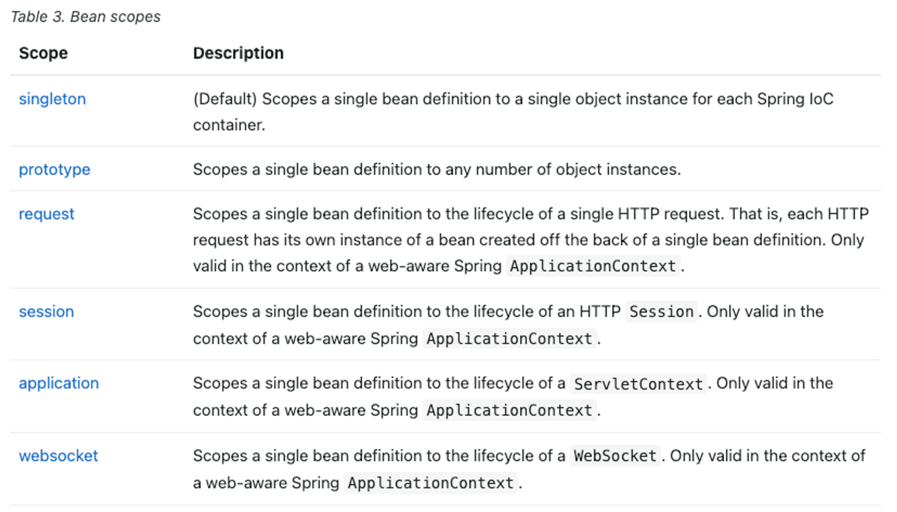
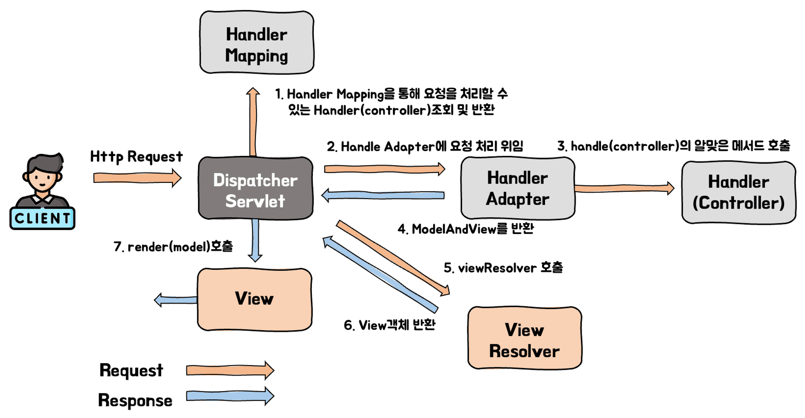
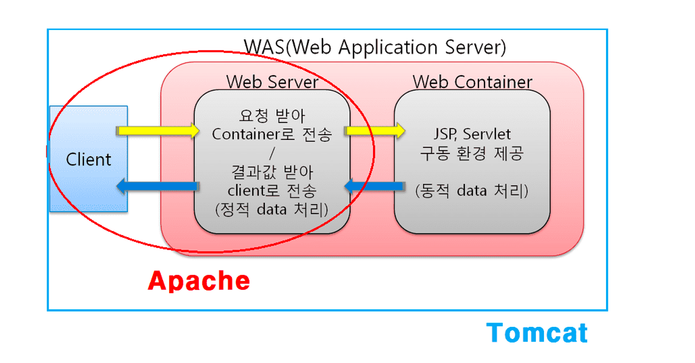
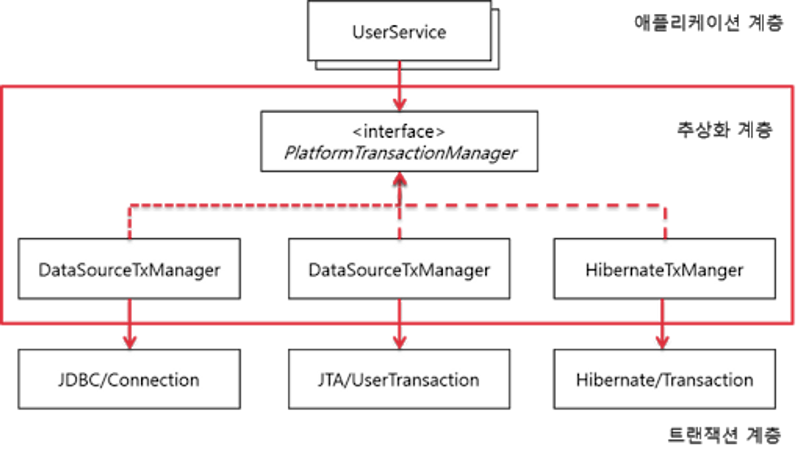

# Spring Framework

왜 프레임워크를 사용할까?

 

- 체계적인 코드관리로 유지보수가 용이하다.
- 기본설계 및 기능 라이브러리를 제공하여 개발 생산성이 높다
- 코드에 대한 재사용성이 높다
- 추상화된 코드 제공을 통해 확장성이 좋다.

왜 스프링을 사용할까?

 

1. **대중적인 언어인 Java 기반의 프레임워크이다.**
2. **시간이 흐르며 프레임워크가 단단해지고 있다.**
3. **다양한 개발사례와 문서, 레퍼런스가 제공되고 있다.**
4. **POJO기반의 구성(Plain Old Java Object)**
5. **DI를 통한 객체 관계 구성**
6. **AOP 지원**
7. **편리한 MVC 구조**
8. **WAS에 독립적인 개발 환경**
9. **개발자가 기본적으로 DI, AOP, 서비스 추상화와 같은 디자인 패턴을 강제적으로 사용하게끔 함으로서 코드 구조 퀄리티의 최소한을 보장한다.**

[[Spring] 우리는 왜 스프링을 사용하는가?](https://seongwon.dev/Spring/20220627-%EC%9A%B0%EB%A6%AC%EB%8A%94-%EC%99%9C-%EC%8A%A4%ED%94%84%EB%A7%81%EC%9D%84-%EC%82%AC%EC%9A%A9%ED%95%A0%EA%B9%8C/)

Spring과 Spring Boot의 차이점은 뭘까요?

 

- Starter의존성을 제공한다.
- WAS서버를 내장으로 갖고 있어 배포가 편해졌다.
- XML로 관리하던 설정들을 [application.properties/yml로](http://application.properties/yml로) 쉽게 할 수 있다.

[[Spring] Spring과 Spring Boot의 차이는 무엇일까?](https://seongwon.dev/Spring/20220628-Spring-vs-SpringBoot/)

Spring의 3대 요소는 무엇이 있을까?

 

AOP, DI, PSA
Spring이 위의 3가지 요소를 통해 어떤 것을 추구할까?

- POJO를 통해 비즈니스 로직에 집중할 수 있도록 하는 것이다.

DI, IoC는 무엇일까요?

 

**DI**는 외부에서 의존 관계를 주입해 결합도를 낮추고 유연성을 높여주는 기술이다.

스프링의 DI는 스프링 컨테이너에 필요한 객체(Bean)들을 싱클턴으로 생성하고 생성한 객체에 의존을 주입하며 제공한다.

DI는 스프링에서 IoC를 구현한하는데 사용하는 패턴이다.

IoC는 객체 또는 프로그램의 제어 권한을 프레임워크에 넘기는 기술이다. 스프링에서 빈을 생성, 소멸의 작업들을 수행하고 의존 주입의 대상까지 스프링이 해주는데 이것이 바로 스프링의 IoC이다.

IoC의 장점

- 유연성 증가 → 다른 구현체로 변경하기 쉽다.
- 객체간 결합도 감소 → 프로그램을 모듈들로 나누기 쉽다.
- 작업의 실행과 구현을 분리할 수 있다.
- 컴포넌트를 격리하거나 의존성을 mocking하는 등의 작업을 통해 테스트를 하기 쉽다.

> 스프링이 DI를 제공하여 이점을 느낀 경험에 대해 설명하라 할 수 있다.

[[Spring] DI,IoC란 무엇일까?](https://seongwon.dev/Spring/20220614-%EC%8A%A4%ED%94%84%EB%A7%81-DI-IoC/)

IoC의 2가지 분류, Spring 외부에서 의존성을 할당해주는 방법 2가지

 

- 의존 주입 방법은 `DL`, `DI`이 있다.
- DL(Dependency Lookup)은 프로그램이 실행되며 동적으로 빈을 바꾸고 싶을 때 사용
    - DL은 의존관계가 있는 객체를 외부에서 주입해주는 것이 아니라 의존 관계가 필요한 객체에서 직접 컨테이너가 제공하는 API를 통해 검색하는 방식이다.
    - 클라이언트 객체(의존관계가 필요한 객체)에서는 의존하고자 하는 인터페이스 타입만 지정해서 검색할 뿐 해당 인터페이스를 구현한 구체적인 클래스 객체에 대한 결정과 해당 객체에 대한 생명 주기는 IoC 컨테이너에서 책임집니다.

DIP(Dependency Inversion Principle)란 무엇일까?

 

- **저수준 모듈이 고수준 모듈에 의존하게 되는 것을 DIP(의존관계 역전 원칙)라 한다.**
- 추상화에 의존하고 구체화에 의존하면 안 된다. 즉, 하위 모듈이 상위 모듈에서 정의한 추상 타입(인터페이스)에 의존하여야 한다.

코딩 실천법

1. 변동성이 큰 구체 클래스를 참조하지 말고 추상 인터페이스를 참조하라
2. 변동성이 큰 구체 클래스로부터 파생하지 말아라
3. 구체 함수를 오버라이드 하지 말아라

Bean이란 무엇일까?

 

스프링을 사용하다보면 DI/IoC에 의해 스프링에게 객체의 생명주기를 맡기게 된다. 이때 스프링은 IoC를 위해 스프링 컨테이너를 만들고 생성한 객체들을 컨테이너에서 관리하는데 해당 객체들을 Bean이라고 한다.

스프링이 빈을 등록하고 관리하는 방법은 xml, Annotation-based configuration, Java-based configuration 방법이 있다.

[[Spring] Bean이란 무엇일까?](https://seongwon.dev/Spring/20220616-%EC%8A%A4%ED%94%84%EB%A7%81-Bean/)

Bean의 라이프사이클에대해 설명해주세요

 

- **객체 생성**
- **의존 결정**: 의존 자동 주입을 통한 의존 설정과 설정 클래스에 있는 의존 주입들이 모두 수행된다.
- **초기화**: 의존 결정이 완료되면 스프링 빈은 빈 객체의 지정된 메서드를 호출하여 빈을 초기화해 준다.
- **소멸**: 스프링 컨테이너가 종료되면 스프링 컨테이너가 빈 객체를 소멸시킨다.

Bean의 Scope는 무엇이 있을까요?

 

### Bean Scope란?

스프링은 자바 객체들을 관리하기 쉽게 IoC컨테이너에 Bean으로 등록하여 사용한다. Bean들은 IoC컨테이너에 의해 생성되고 소멸되는 등의 라이프사이클을 거치게 된다. 이때 Bean이 관리되는 범위를 Bean의 Scope이라고 한다.

### Scope의 종류

스프링 공식문서에는 아래와 같이 6가지 종류의 Scope을 설명하고 있다.

- Singleton, Prototype, Request, Session, Application, WebSocket

- singleton: 스프링에서 default로 사용하는 Scope로 IoC 컨테이너에 한 개의 객체만 생성하여 관리한다.
- prototype: 컨테이너에게 빈을 요청할 때마다 새로운 객체를 생성하여 반환해준다.
- request: Request가 발생하면 bean이 생성되고 종료된다. 같은 API라도 호출될 때마다 새로운 bean이 생성된다.
- session: Http session과 동일한 생명 주기를 가지는 스코프이다.
- application: 서블릿 컨텍스와 동일한 생명주기를 가지는 스코프이다.
- websocket: WebSocket과 동일한 생명주기를 갖는 스코프이다.

[[Spring] Bean이란 무엇일까?](https://seongwon.dev/Spring-MVC/20220616-스프링-Bean/)

[Core Technologies](https://docs.spring.io/spring-framework/docs/current/reference/html/core.html#beans-factory-scopes)

@Bean, @Configuration을 통해 빈을 등록하는 상황은 어떤 상황이 있을까?

 

- 개발자가 직접 제어가 불가능한 라이브러리를 사용할 때
    - Gson과 같이 외부에서 가져다쓰는 클래스인 경우 싱글톤으로 사용해야지 메모리상의 이점을 얻을 수 있다. 하지만 외부 클래스들은 우리가 직접 제어를 할 수 없기에 `@Bean`으로 수동 등록하여 사용해야 한다.
- 애플리케이션 전범위적으로 사용되는 클래스를 등록할 때
- 다형성을 활용하여 여러 구현체를 등록해줘야 할 때
    - `@Bean`을 통해 등록을 해주면 어떤 구현체들이 빈으로 등록되었는지를 `@Configuration`클래스만 보면 되어서 한 눈에 파악하기 쉽고 유지보수하기 좋다.

스프링의 의존 자동 주입 방법

 

- `@Autowired` - 필드, 생성자, 세터 메서드에 해당 어노테이션을 붙여주면 스프링은 **타입**이 일치하는 빈 객체를 찾아서 주입을 해준다.
- 생성자 주입
    - 호출 시점에 1회 호출된다는 보장이 있다. 주입을 받는 객체들이 변하지 않는다는 보장이 되고 필드에 final을 붙일 수 있다
    - 생성자가 1개만 있을 경우 `@Autowired` 어노테이션이 생략 가능하다.
- Setter주입
    - Setter 주입 방법은 주로 주입 받는 객체가 변경될 가능성이 있는 경우에 사용을 한다.
    - 개발자가 실수로 의존 객체를 올바르게 주입하지 않을 경우, 사용 시점에 `NullPointerException`이 발생할 수 있다는 단점이 있다.
    - Setter를 열어둬야 한다.
- 필드 주입
    - 필드에 `@Autowired`를 붙여 바로 의존 관계를 주입하는 방법이다.
    - 필드 주입 방법은 코드가 간결해져 과거에는 많이 사용하였지만 외부에서 접근이 불가능하여 테스트의 어려움이 있다.
    - 스프링과 같은 DI를 제공하는 프레임워크에서만 동작하여 프레임워크의 변경이 있을 시 많은 문제를 초래할 수 있다.

> 📌 필드 주입은 빈의 생성자가 실행된 바로 직후에 실행이 되게 된다.

@RequestParam, @RequestBody, @ModelAndAttribute 차이

 

`@RequestParam`

- Query Parameter나 form-data 형식의 데이터들을 컨트롤러의 method argument로 변환해준다.

`@RequestBody`

- Http request body의 값을 읽어오기 위해 사용되는데 이를 `HttpMessageConverter`를 통해 객체로 역직렬화해준다
- JSON 데이터를 객체로 반환할 때 Spring에 등록되어있는 Jackson라이브러리의 `MappingJackson2HttpMessageConverter`를 사용하여 Reflection을 통해 역직렬화를 하기 때문에 DTO에는 기본 생성자와 getter/setter등이 필요하다.

  > 역직렬화는 stream→객체, 직렬화는 객체→ stream

`@ModelAttribute`

- multipart/form-data 형태의 request body 또는 Query Parameter를 객체로 데이터 바인딩 해주는 것을 알 수 있다.
- ModelAttribute는 RequestBody와 다르게 MessageConverter를 통해 Json을 객체로 변환해주는 방법이 아닌 생성자나 Setter를 통한 데이터 주입을 시켜 객체를 생성한다. 만약 값을 주입해주는 생성자나 setter함수가 없다면 매핑을 시키지 못하고 필드는 null값을 갖게 된다.

Servlet이란?

 

- 서블릿은 동적 웹 페이지(Dynamic Web Page)를 만들 때 사용되는 **자바 기반의 웹 애플리케이션 컴포넌트**이다.
- Sevlet은 하나의 Process로 만들어지고 그 안에 Thread Pool을 만들어 Thread로 처리한다.
    - Servlet이전에 사용하던 CGI는 요청이 왔을 때 요청을 처리하기 위해 Process를 매번 만들어 처리 비용이 비쌌다. 이전 구현체의 재사용이 아닌 새로운 CGI 구현체를 생성하여 사용하여 낭비가 발생했다.
- 서블릿 컨테이너에서 서블릿의 생명주기를 관리한다. (IoC → 서블릿 컨테이너에게 제어를 넘긴다.)

- Servlet의 생명주기
    - `init()`메서드: 서블릿 생성시 초기화 작업을 수행하며 맨 처음 한 번만 수행한다.
    - `service()` 메서드: 서블릿이 요청에 응답하도록 컨테이너에서 실행되는 메서드이다.
    - `destroy()`메서드: 서블릿이 기능을 수행하고 메모리에서 소멸될 때 호출된다.
- Servlet 컨테이너란?

  서블릿 컨테이너는 구현되어 있는 Servlet 클래스들의 규칙에 맞게 서블릿을 관리해주는 컨테이너이다. 서블릿 컨테이너는 서블릿들의 생명 주기를 관리해주며 클라이언트가 요청을 보내면 HttpServletRequest, HttpServletResponse 두 객체를 생성하여 post, get 여부에 따라 동적인 페이지를 생성하여 응답을 보낸다.

  이점

    - **서블릿의 생명주기 관리 (IoC)**
    - **웹 서버와의 통신 지원**
    - **멀티스레딩 지원 및 관리**
    - **선언적인 보안관리**
- 문제점
    1. 1대1 매핑 구조를 갖고 있어 공통 로직에 대해 중복 로직이 발생한다.
    2. 모든 요청들이 서블릿에 의존적이어서 Servlet에 종속적인 프로그램을 작성하게 된다.

[[Spring] Servlet이란?](https://seongwon.dev/Spring-MVC/20220620-Servlet%EC%9D%B4%EB%9E%80/)

Dispatcher Servlet이란? + MVC 동작방식에 대해 설명해주세요

 

Servlet의 단점을 보완하기 위해 만들어진 것이 FrontController Pattern을 적용한 Dispatcher Servlert이 만들어졌다. 요청이 오면 Dispatcher Servlet에서 요청을 처리해줄 Servlet을 찾는 해준다. 요청에 따라 Servlet을 1대1로 생성하는 구조에서 Front Controller가 올바른 핵심 비즈니스 로직을 수행하게 변하여 생성해야하는 Servlet의 개수가 1개로 줄어들었다.

[[Spring] MVC 동작 방식 이해하기](https://seongwon.dev/Spring-MVC/20220621-%EC%8A%A4%ED%94%84%EB%A7%81MVC-%EB%8F%99%EC%9E%91%EB%B0%A9%EC%8B%9D/)

Apache Tomcat이란?

 

- 아파치(Apache)는 오픈 소스 소프트웨어 그룹인 아파치 소프트웨어 재단(Apache Software Foundation, ASF)에서 만든 웹서버 프로그램으로 클라이언트 요청이 들어왔을 때만 응답하는 **정적 타입**
  의 데이터만 처리 가능하다.
- 톰켓은 JAVA EE 기반으로 만들어졌으며 JSP와 Servlet을 구동하기 위한 서블릿 컨테이너 역할을 수행한다. 아파치서버와는 다르게 DB연결, 다른 응용프로그램과 상호 작용 등 동적인 기능들을 사용할 수 있다.
- 아파치 톰캣은 무엇일까? 톰캣이 아파치의 기능 일부를 가져와 제공해주는 형태이기에 합쳐서 아파치 톰캣이라고 부르고 있다.

Application Context와 Servlet Context의 차이가 무엇인가요?

 

Application Context는 Spring내에서 Bean들이 저장되는 context이고 Servlet은 Dispatcher Servlet의 context이다.

AOP란 무엇일까??

 

AOP(Aspect Oriented Programming)은 관점 지향 프로그래밍으로 로직을 기준으로 핵심적인 관점, 부가적인 관점으로 나누어 보고 그 관점을 기준으로 모듈화하는 기술을 의미한다.

흩어진 관심사를 Aspect로 모듈화하고 핵심적인 비즈니스 로직에서 분리하여 재사용하겠다는 것이 AOP의 취지이다.

**스프링 AOP의 특징**

- 프록시 패턴 기반의 AOP 구현체, 프록시 객체를 쓰는 이유는 접근 제어 및 부가기능을 추가하기 위해서임
- 스프링 빈에만 AOP를 적용 가능
- 모든 AOP 기능을 제공하는 것이 아닌 스프링 IoC와 연동하여 엔터프라이즈 애플리케이션에서 가장 흔한 문제(중복코드, 프록시 클래스 작성의 번거로움, 객체들 간 관계 복잡도 증가 ...)에 대한 해결책을 지원하는 것이 목적

**대표적인 예시**

- 스프링의 Transaction

@Valid 어노테이션은 무엇이며 동작은 어디서 할까?

 

`@Valid` 어노테이션은 잘못된 Requst Body 값에 대해 역직렬화 과정에서 해당 값의 유효성을 검증하는 기술이다.

Valid 어노테이션은 Argument Resolver에서 동작을 한다.

그리고 에러가 발생할 경우 `MethodArgumentNotValidException` 이 발생하게 되어 에러를 핸들링하려면 `ControllerAdvice`에서 해당 에러를 잡아야한다.

[https://seongwon.dev/Spring-MVC/20220622-Valid란/](https://seongwon.dev/Spring-MVC/20220622-Valid란/)

Spring Event에 대해 설명해주세요

 

이벤트는 말 그대로 애플리케이션 내에서 어떠한 상황이 발생했을 때 발생시킬 수 있는 것이다.

스프링은 기본적으로 Event메커니즘을 제공하고 있다.

이러한 이벤트는 트리거 용도와 시스템간의 동기화 역할에 사용된다. 그리고 잘 사용하면 클래스, 패키지간 의존성 제거에 도움을 줄 수 있다.

Spring이 어떻게 Filter를 이용할까?

 

#### Spring

  과거에는 Spring Context외부에 있는 Filter는 직접 이용할 수 없었다. 하지만 DelegatingFilterProxy가 생기며 이용할 수 있게 되었다.

  DelegatingFilterProxy는 서블릿 컨테이너에서 관리되는 프록시용 필터로써 우리가 만든 필터를 가지고 있다. 필터에 관련한 빈 등록이 요청이 오면 DelegatingFilterProxy가 요청을 받아서 우리가 만든 필터(스프링 빈)에게 요청을 위임한다.

  1. Filter 구현체가 스프링 빈으로 등록됨
  2. ServletContext가 Filter 구현체를 갖는 DelegatingFilterProxy를 생성함
  3. ServletContext가 DelegatingFilterProxy를 서블릿 컨테이너에 필터로 등록함
  4. 요청이 오면 DelegatingFilterProxy가 필터 구현체에게 요청을 위임하여 필터 처리를 진행함

#### Spring Boot

  SpringBoot라면 DelegatingFilterProxy조차 필요가 없다. 왜냐하면 SpringBoot가 내장 웹서버를 지원하면서 톰캣과 같은 서블릿 컨테이너까지 SpringBoot가 제어가능하기 때문이다. 그래서 SpringBoot에서는 ServletContext에 필터(Filter) 빈을 DelegatingFilterProxy로 감싸서 등록하지 않아도 된다. SpringBoot가 서블릿 필터의 구현체 빈을 찾으면 DelegatingFilterProxy 없이 바로 필터 체인(Filter Chain)에 필터를 등록해주기 때문이다.

``
# JPA

JPA에서 영속성 컨텍스트에 대해 설명해주세요

 

- **엔티티를 영구 저장하는 환경**이라는 뜻을 가진 **논리적인 개념**으로 어플리케이션과 DB사이에서 객체를 보관하는 가상의 DB같은 역할을 한다. 즉, 애플리케이션에서 DB에 저장하기 전에 사용을 하는 임시 저장 공간이라고 이해를 하면 편할 것이다.
- 장점
  - **1차 캐시**
  - 영속성 컨텍스트 내의 영속 엔티티는 **동일성 보장**
  - 트랜잭션을 지원하는 **쓰기 지연**
  - **변경 감지(Dirty Checking)**

Dirty Checking에 대해 설명해주세요.

 

영속성 컨텍스트는 엔티티의 수정이 일어났을 때 개발자가 영속성 컨텍스트에 따로 알려주지 않아도 알아서 변경 사항을 체크해준다. 이것을 Dirty checking이라고 한다.

1차 캐시에 entity를 저장할 때, 스냅샷 필드도 따로 저장하여 commit이나 flush를 할 때 해당 entity와 스냅샷을 비교하여 변경사항이 있으면 알아서 UPDATE SQL을 만들어서 DB에 전송한다.

N+1문제를 해결할 수 있는 방법은 무엇이 있을까요?

 

Fetch join, EntityGraph, Batch size

**JoinFetch는 Inner Join, Entity Graph는 Outer Join**

→ 두 방법은 1:N관계에서 데이터가 증가하는 문제가 발생한다.

→ Fetch Join은 OneToMany관계에서 페이징을 하지 못한다

→ 데이터 뻥튀기 때문에 둘 이상의 컬렉션을 페치할 수 없다. (카테시안 곱으로 만들어진다)

> Hibernate 사용 시, 둘 이상의 컬렉션을 사용한 Fetch Join은 오류를 발생시킨다.

스프링의 트랜잭션

 

# 스프링 트랜잭션의 3가지 핵심 기술

스프링은 트랜잭션과 관련된 3가지 핵심 기술을 제공하고 있다.

1. 트랜잭션 동기화
2. 트랜잭션 추상화
3. AOP를 이용한 트랜잭션 분리

## 트랜잭션 동기화

Spring JDBC가 아닌 Java에서 제공하는 JDBC를 통해 개발을 한다면 트랜잭션으로 작업을 관리하기 위해 Connection 객체를 공유하는 등의 불필요한 작업들이 많이 발생한다. 스프링은 이러한 불필요한 작업들을 해결해보고자 트랜잭션을 시작하기 위한 **Connection객체를 특별한 저장소에 보관해두고 필요할 때 꺼내쓸 수 있도록 하는 트랜잭션 동기화 기술을 제공**하고 있다. 트랜잭션 동기화는 작업 쓰레드마다 Connection객체를 독립적으로 관리하기에 멀티 쓰레드 환경에서도 충돌이 발생할 여지가 없다.

## 트랜잭션 추상화

개발자가 JDBC가 아닌 Hibernate와 같은 기술을 쓴다면 JDBC에 종속적인 트랜잭션 동기화 코드들은 다른 문제들을 유발하게 된다. 대표적으로는 Hibernate에서 Connection이 아닌 Session객체를 사용하는 차이가 있다. 이와 같이 기술에 종속적인 문제들을 해결하기 위해 스프링에서는 트랜잭션 추상화 기술을 제공하고 있다.

스프링은 **트랜잭션 기술의 공통점을 담은 추상화 기술을 제공하고 있어 애플리케이션에 기술의 종속적인 코드를 이용하지 않고도 일관되게 트랜잭션을 처리할 수 있다.**

스프링에서는  `PlatformTransactionManager` 인터페이스를 제공하여 개발자는 사용하는 기술과 무관하게 해당 인터페이스를 통해 트랜잭션을 공유, 커밋, 롤백할 수 있다.

## AOP를 이용한 트랜잭션 분리

기존 트랜잭션을 적용한 비즈니스 코드들에는 트랜잭션 코드와 비즈니스 코드가 결합되어 2가지 책임을 갖고 있었다. 스프링에서는 이러한 **책임을 분리하고자 AOP를 적용하여 트랜잭션 로직들을 트랜잭션 어노테이션(**`@Transactional`**)을 붙이면 자동으로 적용되도록 하였다.** 덕분에 비즈니스 코드와 트랜잭션 코드가 분리가 되었다.

# 트랜잭션의 세부 설정들

## Propagation

트랜잭션의 경계에서 이미 진행중인 트랜잭션이 있거나 없을 때 어떻게 동작할 것인가를 결정하는 방식을 의미한다. 스프링이 제공하는 선언적 트랜잭션(어노테이션을 통한 트랜잭션 선언)의 장점 중 하나는 여러 트랜잭션 적용 범위를 묶어서 커다란 하나의 트랜잭션 경계를 만들 수 있다는 점이다. 개발자들은 `@Transactional`의 propagation 속성을 통해 트랜잭션의 전파 여부를 결정할 수 있다.

- REQUIRED
  - Default 속성으로 모든 트랜잭션 매니저가 지원한다.
  - 미리 시작된 트랜잭션이 있으면 참여하고 없으면 새로 시작한다. 즉, 하나의 트랜잭션이 실행 후 다른 트랜잭션이 설정된 메서드가 호출되면 같은 트랜잭션으로 묶인다.
- SUPPORTS
  - 미리 시작된 트랜잭션이 있으면 참가하고 그렇지 않으면 트랜잭션 없이 진행한다.
  - 트랜잭션이 없어도 경계 안에서 Connection객체나 Hibernate의 Session 등은 공유할 수 있다.
- MANDATORY
  - 이미 시작된 트랜잭션이 있으면 참가하고 없으면 새로 시작하는 대신 예외를 발생시킨다.
  - 혼자서 독맂벅으로 트랜잭션을 진행하면 안되는 경우에 사용한다.
- REQUIRES_NEW
  - 이미 진행중인 트랜잭션이 있으면 이를 보류하고 새로운 트랜잭션을 만들어 시작한다.
  - 항상 새로운 트랜잭션을 사용해야하는 경우에 사용한다.
- NOT_SUPPORTED
  - 이미 진행중인 트랜잭션이 있으면 이를 보류하고 트랜잭션을 사용하지 않도록 한다.
- NEVER
  - 이미 진행중인 트랜잭션이 있으면 예외를 발생시켜 트랜잭션을 사용하지 않도록 강제한다.
- NESTED
  - 이미 진행중인 트랜잭션이 있으면 트랜잭션 안에 자식 트랜잭션을 만들어 시작한다.
  - 부모 트랜잭션의 커밋과 롤백에는 자식이 영향을 받지만 자식의 커밋과 롤백은 부모 트랜잭션에게 영향을 주지 않는다.
  - REQUIRED와 다른 점은 자식 트랜잭션이 독립적이라 롤백이 발생하여도 부모 트랜잭션이 죽지 않는다. 하지만 REQUIRED는 부모가 죽게 된다.

## Isolation

DefaultTransactionDefinition에 설정된 격리수준은 ISOLATION_DEFAULT로 DataSource에 정의된 격리 수준을 따르고 있다. 기본적으로는 DB나 DataSource에 설정된 기본 격리 수준을 따르는 것이 좋지만, 특별한 작업을 수행하는 메소드라면 독자적으로 지정해줄 필요가 있다.

- DEFAULT
  - Data Access기술 또는 DB Driver의 Default 설정을 따른다.
  - 대부분의 DB들은 READ_COMMITED를 기본 격리수준으로 가진다. (드라이버와 DB문서를 참고해서 기본 격리 수준을 확인해야 한다.)
- READ_UNCOMMITTED
  - 하나의 트랜잭션이 커밋되기 전에 변화가 다른 트랜잭션에 노출될 수 있다.
  - 일관성이 떨어지더라도 성능을 극대화할 때 의도적으로 사용한다.
- READ_COMMITTED
  - 스프링의 기본 속성이다.
  - 다른 트랜잭션이 커밋하지 않은 정보는 읽을 수 없다.
  - 하나의 트랜잭션이 읽은 데이터를 다른 트랜잭션이 수정할 수는 있다. → 이러한 이유 때문에 하나의 트랜잭션이 같은 데이터를 읽을 때 다른 내용이 나올 수 있다.
- REPEATABLE_READ
  - 하나의 트랜잭션이 읽은 데이터를 다른 트랜잭션이 수정할 수 없도록 막아준다.
  - 새로 데이터를 추가하는 것은 막지 않아 SELECT로 조회를 할 때 트랜잭션이 끝나기 전에 기존에 없던 데이터가 발견될 수 있다.
- SERIALIZABLE
  - 가장 강력한 트랜잭션 격리 수준으로 트랜잭션을 순차적으로 진행시켜준다.
  - 성능이 가장 떨어져서 극단적으로 안전한 작업이 필요한 경우가 아니면 사용하지 않는다.

## timeout(제한 시간)

트랜잭션을 수행하는 제한 시간을 설정할 수 있다. 별도 설정이 없는 경우 트랜잭션 시스템의 제한시간을 따르고 제한 시간을 지정하였는데 핻강 기능을 지원하지 못하면 예외가 발생할 수 있다.

## readOnly

읽기 전용으로 설정해두면 트랜잭션 내에서 데이터를 조작할 수 있는 일을 막을 수 있다. 또한 기술에 따라 성능이 향상될 수 있다고 한다.

> 클래스단에서 Default로 `@Transactional(readOnly = true)`를 설정한 후 데이터를 조작해야하는 메서드에 `@Transactional`를 붙여 데이터를 조작하는 것이 좋다.
>

- [[Spring] 트랜잭션에 대한 이해와 Spring이 제공하는 Transaction(트랜잭션) 핵심 기술 - (1/3)](https://mangkyu.tistory.com/154)
- [[Spring] Spring 트랜잭션의 세부 설정(전파 속성, 격리수준, 읽기전용, 롤백/커밋 예외 등) - (2/3)](https://mangkyu.tistory.com/169)
- [[10분 테코톡] 후니의 스프링 트랜잭션](https://www.youtube.com/watch?v=cc4M-GS9DoY)

